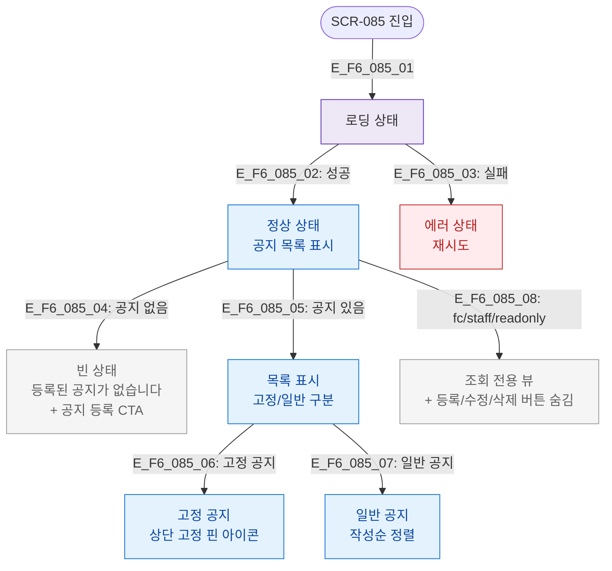

## 다이어그램

```mermaid
flowchart TD
    Entry([SCR-085 진입]) -->|E_F6_085_01| Loading[로딩 상태]
    Loading -->|E_F6_085_02: 성공| Normal[정상 상태\n공지 목록 표시]
    Loading -->|E_F6_085_03: 실패| ErrorState[에러 상태\n재시도]

    Normal -->|E_F6_085_04: 공지 없음| Empty[빈 상태\n등록된 공지가 없습니다\n+ 공지 등록 CTA]
    Normal -->|E_F6_085_05: 공지 있음| HasNotices[목록 표시\n고정/일반 구분]

    HasNotices -->|E_F6_085_06: 고정 공지| Pinned[고정 공지\n상단 고정 핀 아이콘]
    HasNotices -->|E_F6_085_07: 일반 공지| Regular[일반 공지\n작성순 정렬]

    Normal -->|E_F6_085_08: fc/staff/readonly| ReadOnlyView[조회 전용 뷰\n+ 등록/수정/삭제 버튼 숨김]

    classDef screen fill:#E3F2FD,stroke:#1976D2,color:#0D47A1
    classDef error fill:#FFEBEE,stroke:#C62828,color:#B71C1C
    classDef system fill:#EDE7F6,stroke:#5E35B2
    classDef rbacBlocked fill:#F5F5F5,stroke:#9E9E9E,color:#616161
    class Normal,HasNotices,Pinned,Regular screen
    class ErrorState error
    class Loading system
    class ReadOnlyView,Empty rbacBlocked
```

## TC 후보
- TC-085-006: 공지 없음 → 빈 상태 + 등록 CTA
