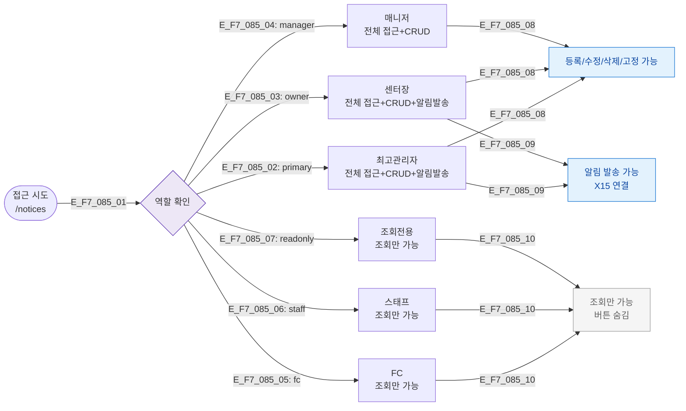

## 다이어그램

## 역할별 접근 매트릭스
| 역할 | 접근 | 조회 | 등록 | 수정 | 삭제 | 알림발송 |
|------|:---:|:---:|:---:|:---:|:---:|:------:|
| primary | ✅ | ✅ | ✅ | ✅ | ✅ | ✅ |
| owner | ✅ | ✅ | ✅ | ✅ | ✅ | ✅ |
| manager | ✅ | ✅ | ✅ | ✅ | ✅ | ❌ |
| fc | ✅ | ✅ | ❌ | ❌ | ❌ | ❌ |
| staff | ✅ | ✅ | ❌ | ❌ | ❌ | ❌ |
| readonly | ✅ | ✅ | ❌ | ❌ | ❌ | ❌ |

## TC 후보
- TC-085-NEG-001: staff → /notices → 등록/수정/삭제 버튼 미표시
