## 다이어그램

```mermaid
flowchart TD
    SCR085[SCR-085 공지사항 관리]

    SCR085 -->|"F9_085_01: POST 성공"|T_PostOK[토스트 success\n공지가 등록되었습니다]
    SCR085 -->|"F9_085_02: PATCH 성공"|T_PatchOK[토스트 success\n공지가 수정되었습니다]
    SCR085 -->|"F9_085_03: DELETE 성공"|T_DelOK[토스트 success\n공지가 삭제되었습니다]
    SCR085 -->|"F9_085_04: 고정 설정 성공"|T_PinOK[토스트 info\n공지가 고정되었습니다]
    SCR085 -->|"F9_085_05: 고정 해제 성공"|T_UnpinOK[토스트 info\n고정이 해제되었습니다]

    SCR085 -->|"F9_085_06: 알림 발송 성공"|T_NotifyOK[토스트 success\n알림이 발송되었습니다]
    SCR085 -->|"F9_085_07: 알림 발송 실패"|T_NotifyFail[토스트 warning\n알림 발송 실패\n공지는 저장됨]

    SCR085 -->|"F9_085_08: 제목 공백 시도"|T_TitleErr[인라인 에러\n제목을 입력해 주세요]
    SCR085 -->|"F9_085_09: 내용 공백 시도"|T_ContentErr[인라인 에러\n내용을 입력해 주세요]
    SCR085 -->|"F9_085_10: 고정 4개 시도"|T_PinMax[토스트 warning\n고정 공지는 최대 3개입니다]

    SCR085 -->|"F9_085_11: 401 세션 만료"|T_Auth[토스트 error\n세션이 만료되었습니다\n재로그인 필요]
    SCR085 -->|"F9_085_12: 403 권한 없음"|T_Perm[토스트 error\n권한이 없습니다]
    SCR085 -->|"F9_085_13: 500 서버 에러"|T_Server[토스트 error\n일시적 오류입니다\n잠시 후 다시 시도]

    classDef screen fill:#E3F2FD,stroke:#1976D2,color:#0D47A1
    classDef success fill:#E8F5E9,stroke:#2E7D32,color:#1B5E20
    classDef info fill:#E3F2FD,stroke:#1565C0,color:#0D47A1
    classDef warning fill:#FFF8E1,stroke:#F9A825,color:#F57F17
    classDef error fill:#FFEBEE,stroke:#C62828,color:#B71C1C
    class SCR085 screen
    class T_PostOK,T_PatchOK,T_DelOK,T_NotifyOK success
    class T_PinOK,T_UnpinOK info
    class T_NotifyFail,T_PinMax warning
    class T_TitleErr,T_ContentErr,T_Auth,T_Perm,T_Server error
```

## 토스트 메시지 목록
| ID | 트리거 | 타입 | 메시지 | |----|--------|------|--------| | F9_085_01 | 공지 등록 성공 | success | 공지가 등록되었습니다 | | F9_085_02 | 공지 수정 성공 | success | 공지가 수정되었습니다 | | F9_085_03 | 공지 삭제 성공 | success | 공지가 삭제되었습니다 | | F9_085_04 | 고정 설정 성공 | info | 공지가 고정되었습니다 | | F9_085_05 | 고정 해제 성공 | info | 고정이 해제되었습니다 | | F9_085_06 | 알림 발송 성공 | success | 알림이 발송되었습니다 | | F9_085_07 | 알림 발송 실패 | warning | 알림 발송 실패 (공지는 저장됨) | | F9_085_08 | 제목 공백 | error(inline) | 제목을 입력해 주세요 | | F9_085_09 | 내용 공백 | error(inline) | 내용을 입력해 주세요 | | F9_085_10 | 고정 4개 시도 | warning | 고정 공지는 최대 3개입니다 | | F9_085_11 | 401 | error | 세션이 만료되었습니다 | | F9_085_12 | 403 | error | 권한이 없습니다 | | F9_085_13 | 500 | error | 일시적 오류입니다 |
