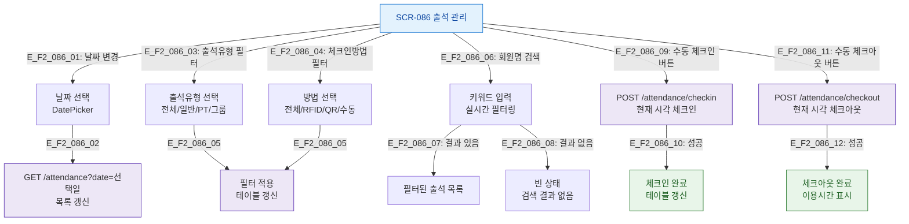

## 다이어그램

```mermaid
flowchart TD
    SCR086[SCR-086 출석 관리]

    SCR086 -->|E_F2_086_01: 날짜 변경| DateChange[날짜 선택\nDatePicker]
    DateChange -->|E_F2_086_02| Reload[GET /attendance?date=선택일\n목록 갱신]

    SCR086 -->|E_F2_086_03: 출석유형 필터| TypeFilter[출석유형 선택\n전체/일반/PT/그룹]
    SCR086 -->|E_F2_086_04: 체크인방법 필터| MethodFilter[방법 선택\n전체/RFID/QR/수동]

    TypeFilter & MethodFilter -->|E_F2_086_05| FilterApply[필터 적용\n테이블 갱신]

    SCR086 -->|E_F2_086_06: 회원명 검색| SearchInput[키워드 입력\n실시간 필터링]
    SearchInput -->|E_F2_086_07: 결과 있음| ResultList[필터된 출석 목록]
    SearchInput -->|E_F2_086_08: 결과 없음| EmptySearch[빈 상태\n검색 결과 없음]

    SCR086 -->|E_F2_086_09: 수동 체크인 버튼| ManualCheckin[POST /attendance/checkin\n현재 시각 체크인]
    ManualCheckin -->|E_F2_086_10: 성공| CheckinOK[체크인 완료\n테이블 갱신]

    SCR086 -->|E_F2_086_11: 수동 체크아웃 버튼| ManualCheckout[POST /attendance/checkout\n현재 시각 체크아웃]
    ManualCheckout -->|E_F2_086_12: 성공| CheckoutOK[체크아웃 완료\n이용시간 표시]

    classDef screen fill:#E3F2FD,stroke:#1976D2,color:#0D47A1
    classDef success fill:#E8F5E9,stroke:#2E7D32,color:#1B5E20
    classDef system fill:#EDE7F6,stroke:#5E35B2
    class SCR086 screen
    class CheckinOK,CheckoutOK success
    class Reload,FilterApply,ManualCheckin,ManualCheckout system
```

## TC 후보
- TC-086-002: 날짜 변경 → 해당 날짜 출석 목록 갱신
- TC-086-003: 수동 체크인 버튼 → 현재 시각으로 체크인 기록
