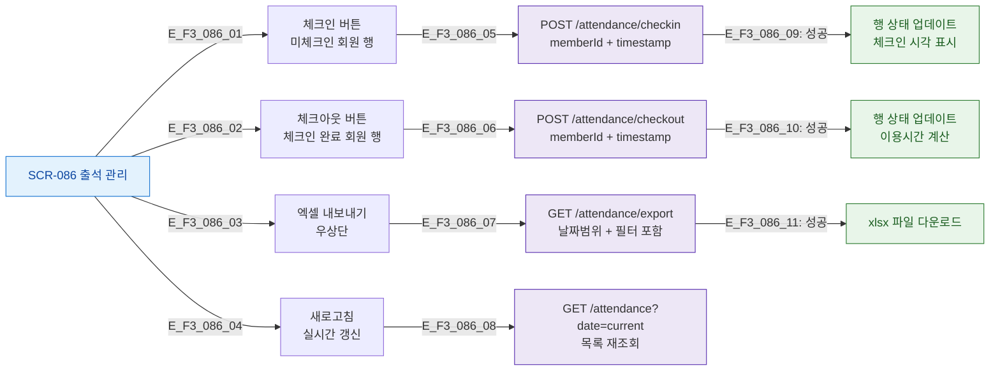

## 다이어그램

```mermaid
flowchart LR
    SCR086[SCR-086 출석 관리]

    SCR086 -->|E_F3_086_01| BtnCheckin[체크인 버튼\n미체크인 회원 행]
    SCR086 -->|E_F3_086_02| BtnCheckout[체크아웃 버튼\n체크인 완료 회원 행]
    SCR086 -->|E_F3_086_03| BtnExport[엑셀 내보내기\n우상단]
    SCR086 -->|E_F3_086_04| BtnRefresh[새로고침\n실시간 갱신]

    BtnCheckin -->|E_F3_086_05| ACT_Checkin[POST /attendance/checkin\nmemberId + timestamp]
    BtnCheckout -->|E_F3_086_06| ACT_Checkout[POST /attendance/checkout\nmemberId + timestamp]
    BtnExport -->|E_F3_086_07| ACT_Export[GET /attendance/export\n날짜범위 + 필터 포함]
    BtnRefresh -->|E_F3_086_08| ACT_Refresh[GET /attendance?date=current\n목록 재조회]

    ACT_Checkin -->|"E_F3_086_09: 성공"| OK_Checkin[행 상태 업데이트\n체크인 시각 표시]
    ACT_Checkout -->|"E_F3_086_10: 성공"| OK_Checkout[행 상태 업데이트\n이용시간 계산]
    ACT_Export -->|"E_F3_086_11: 성공"| OK_Export[xlsx 파일 다운로드]

    classDef screen fill:#E3F2FD,stroke:#1976D2,color:#0D47A1
    classDef success fill:#E8F5E9,stroke:#2E7D32,color:#1B5E20
    classDef system fill:#EDE7F6,stroke:#5E35B2
    class SCR086 screen
    class OK_Checkin,OK_Checkout,OK_Export success
    class ACT_Checkin,ACT_Checkout,ACT_Export,ACT_Refresh system
```

## TC 후보
- TC-086-003: [체크인] 버튼 → POST 성공 → 행 시각 표시
- TC-086-004: [체크아웃] 버튼 → 이용시간 자동 계산
