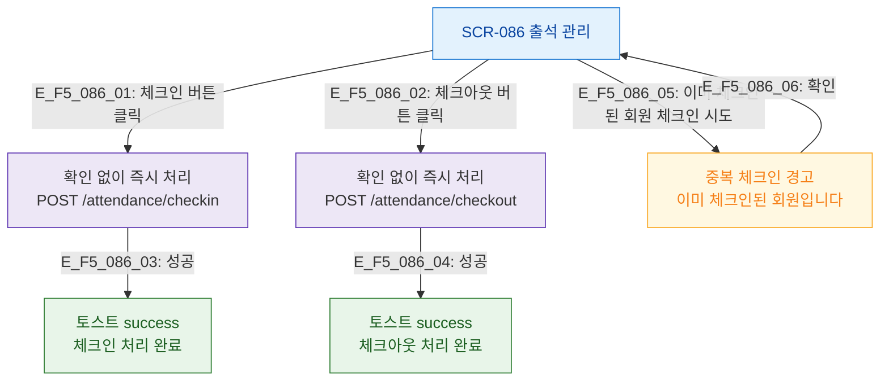

## 다이어그램

```mermaid
flowchart TD
    SCR086[SCR-086 출석 관리]

    SCR086 -->|"E_F5_086_01: 체크인 버튼 클릭"| DirectCheckin[확인 없이 즉시 처리\nPOST /attendance/checkin]
    SCR086 -->|"E_F5_086_02: 체크아웃 버튼 클릭"| DirectCheckout[확인 없이 즉시 처리\nPOST /attendance/checkout]

    DirectCheckin -->|"E_F5_086_03: 성공"| T_CheckinOK[토스트 success\n체크인 처리 완료]
    DirectCheckout -->|"E_F5_086_04: 성공"| T_CheckoutOK[토스트 success\n체크아웃 처리 완료]

    SCR086 -->|"E_F5_086_05: 이미 체크인된 회원 체크인 시도"| DLG_Dup[중복 체크인 경고\n이미 체크인된 회원입니다]
    DLG_Dup -->|"E_F5_086_06: 확인"| SCR086

    classDef screen fill:#E3F2FD,stroke:#1976D2,color:#0D47A1
    classDef success fill:#E8F5E9,stroke:#2E7D32,color:#1B5E20
    classDef warning fill:#FFF8E1,stroke:#F9A825,color:#F57F17
    classDef system fill:#EDE7F6,stroke:#5E35B2
    class SCR086 screen
    class T_CheckinOK,T_CheckoutOK success
    class DLG_Dup warning
    class DirectCheckin,DirectCheckout system
```

## TC 후보
- TC-086-003: 체크인 버튼 → 즉시 처리 → 성공 토스트
