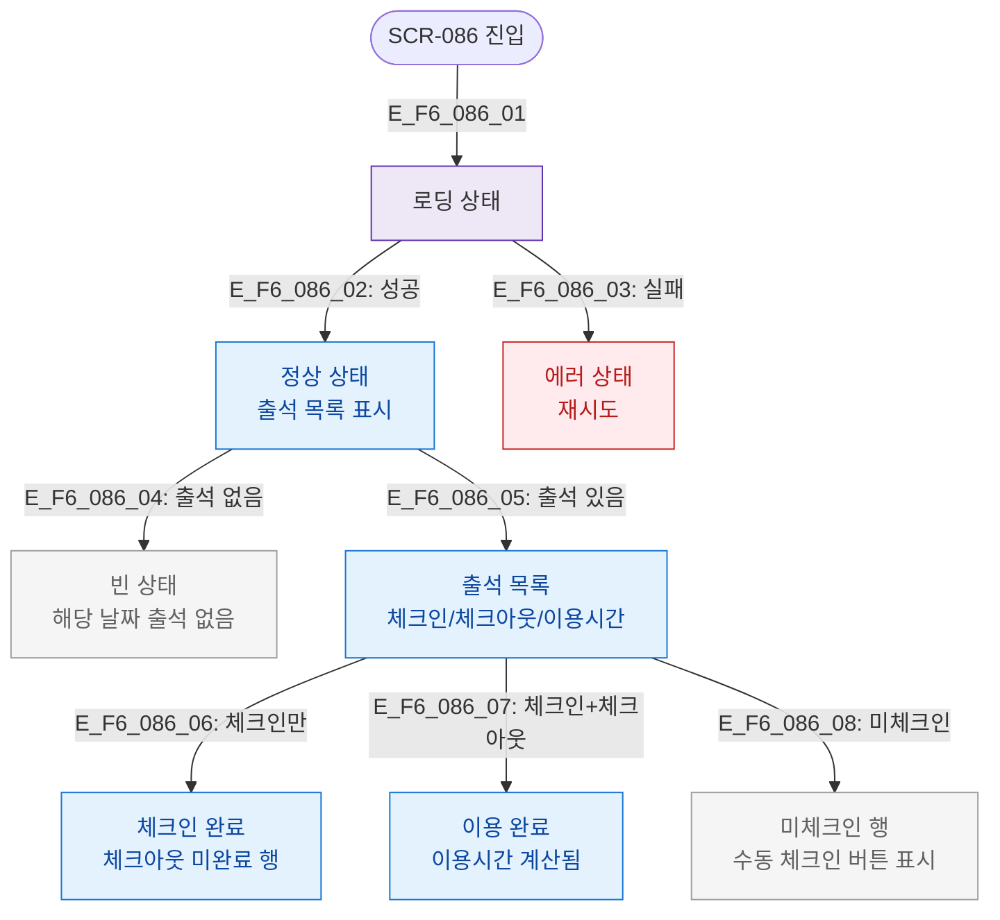

## 다이어그램

```mermaid
flowchart TD
    Entry([SCR-086 진입]) -->|E_F6_086_01| Loading[로딩 상태]
    Loading -->|"E_F6_086_02: 성공"| Normal[정상 상태\n출석 목록 표시]
    Loading -->|"E_F6_086_03: 실패"| ErrorState[에러 상태\n재시도]

    Normal -->|"E_F6_086_04: 출석 없음"| Empty[빈 상태\n해당 날짜 출석 없음]
    Normal -->|"E_F6_086_05: 출석 있음"| HasRecords[출석 목록\n체크인/체크아웃/이용시간]

    HasRecords -->|"E_F6_086_06: 체크인만"| CheckinOnly[체크인 완료\n체크아웃 미완료 행]
    HasRecords -->|"E_F6_086_07: 체크인+체크아웃"| FullRecord[이용 완료\n이용시간 계산됨]
    HasRecords -->|"E_F6_086_08: 미체크인"| NotCheckin[미체크인 행\n수동 체크인 버튼 표시]

    classDef screen fill:#E3F2FD,stroke:#1976D2,color:#0D47A1
    classDef error fill:#FFEBEE,stroke:#C62828,color:#B71C1C
    classDef system fill:#EDE7F6,stroke:#5E35B2
    classDef rbacBlocked fill:#F5F5F5,stroke:#9E9E9E,color:#616161
    class Normal,HasRecords,CheckinOnly,FullRecord screen
    class ErrorState error
    class Loading system
    class Empty,NotCheckin rbacBlocked
```

## TC 후보
- TC-086-007: 해당 날짜 출석 없음 → 빈 상태 표시
