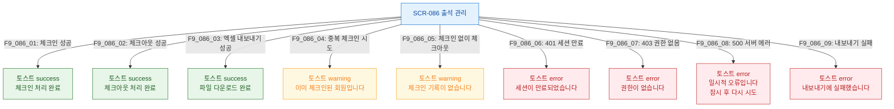

## 다이어그램

## 토스트 메시지 목록
| ID | 트리거 | 타입 | 메시지 |
|----|--------|------|--------|
| F9_086_01 | 체크인 성공 | success | 체크인 처리 완료 |
| F9_086_02 | 체크아웃 성공 | success | 체크아웃 처리 완료 |
| F9_086_03 | 엑셀 내보내기 성공 | success | 파일 다운로드 완료 |
| F9_086_04 | 중복 체크인 | warning | 이미 체크인된 회원입니다 |
| F9_086_05 | 체크인 없이 체크아웃 | warning | 체크인 기록이 없습니다 |
| F9_086_06 | 401 | error | 세션이 만료되었습니다 |
| F9_086_07 | 403 | error | 권한이 없습니다 |
| F9_086_08 | 500 | error | 일시적 오류입니다 |
| F9_086_09 | 내보내기 실패 | error | 내보내기에 실패했습니다 |
