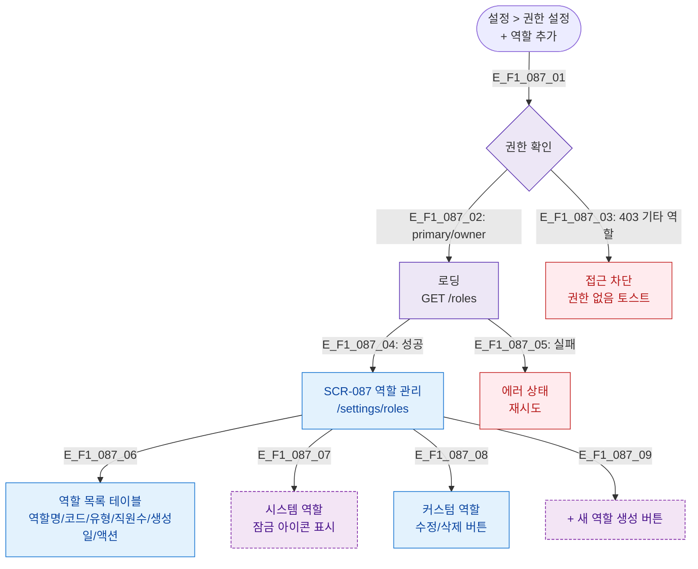

## 다이어그램

```mermaid
flowchart TD
    Sidebar([설정 > 권한 설정\n+ 역할 추가]) -->|E_F1_087_01| Auth{권한 확인}
    Auth -->|"E_F1_087_02: primary/owner"| Loading[로딩\nGET /roles]
    Auth -->|"E_F1_087_03: 403 기타 역할"| Blocked[접근 차단\n권한 없음 토스트]

    Loading -->|"E_F1_087_04: 성공"| SCR087[SCR-087 역할 관리\n/settings/roles]
    Loading -->|"E_F1_087_05: 실패"| ErrorState[에러 상태\n재시도]

    SCR087 -->|E_F1_087_06| RoleTable[역할 목록 테이블\n역할명/코드/유형/직원수/생성일/액션]
    SCR087 -->|E_F1_087_07| SystemRoles[시스템 역할\n잠금 아이콘 표시]
    SCR087 -->|E_F1_087_08| CustomRoles[커스텀 역할\n수정/삭제 버튼]
    SCR087 -->|E_F1_087_09| BtnNewRole[+ 새 역할 생성 버튼]

    classDef screen fill:#E3F2FD,stroke:#1976D2,color:#0D47A1
    classDef newFeature fill:#F3E5F5,stroke:#7B1FA2,color:#4A148C,stroke-dasharray:4 2
    classDef error fill:#FFEBEE,stroke:#C62828,color:#B71C1C
    classDef system fill:#EDE7F6,stroke:#5E35B2
    class SCR087,RoleTable,CustomRoles screen
    class BtnNewRole,SystemRoles newFeature
    class ErrorState,Blocked error
    class Loading,Auth system
```

## TC 후보
- TC-087-001: 설정 > 권한 설정 > + 역할 추가 → 역할 목록 표시
