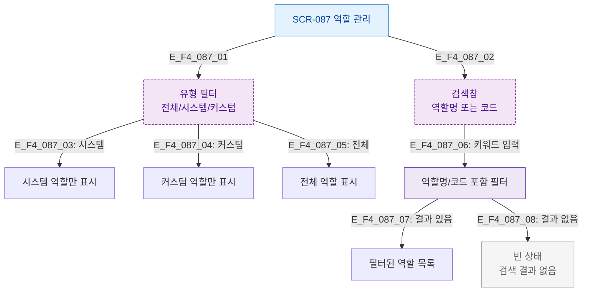

## 다이어그램

```mermaid
flowchart TD
    SCR087[SCR-087 역할 관리]

    SCR087 -->|E_F4_087_01| TypeFilter[유형 필터\n전체/시스템/커스텀]
    SCR087 -->|E_F4_087_02| SearchBar[검색창\n역할명 또는 코드]

    TypeFilter -->|"E_F4_087_03: 시스템"| SystemOnly[시스템 역할만 표시]
    TypeFilter -->|"E_F4_087_04: 커스텀"| CustomOnly[커스텀 역할만 표시]
    TypeFilter -->|"E_F4_087_05: 전체"| AllRoles[전체 역할 표시]

    SearchBar -->|"E_F4_087_06: 키워드 입력"| SearchApply[역할명/코드 포함 필터]
    SearchApply -->|"E_F4_087_07: 결과 있음"| ResultList[필터된 역할 목록]
    SearchApply -->|"E_F4_087_08: 결과 없음"| EmptySearch[빈 상태\n검색 결과 없음]

    classDef screen fill:#E3F2FD,stroke:#1976D2,color:#0D47A1
    classDef newFeature fill:#F3E5F5,stroke:#7B1FA2,color:#4A148C,stroke-dasharray:4 2
    classDef system fill:#EDE7F6,stroke:#5E35B2
    classDef rbacBlocked fill:#F5F5F5,stroke:#9E9E9E,color:#616161
    class SCR087 screen
    class SearchBar,TypeFilter newFeature
    class SearchApply system
    class EmptySearch rbacBlocked
```

## TC 후보
- TC-087-005: 유형 필터 "커스텀" → 커스텀 역할만 표시
