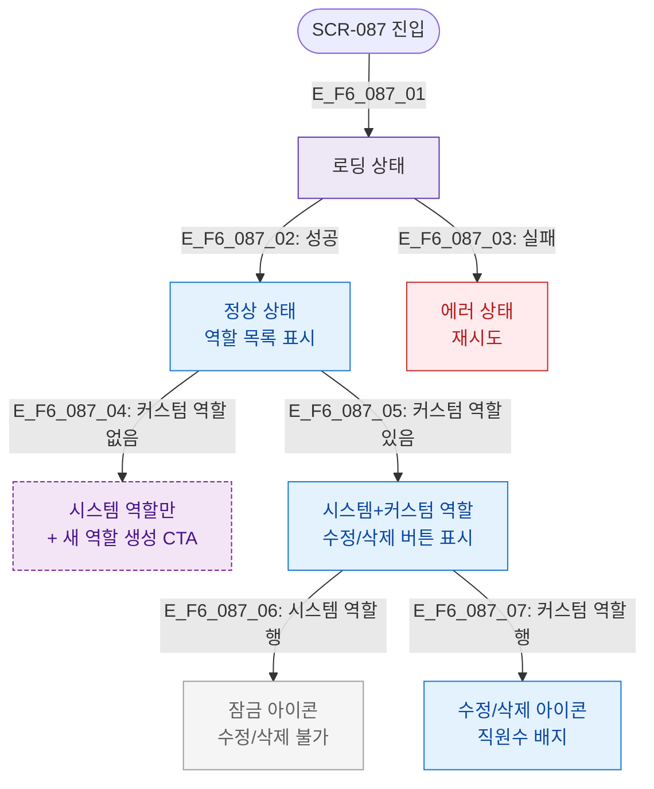

## 다이어그램

```mermaid
flowchart TD
    Entry([SCR-087 진입]) -->|E_F6_087_01| Loading[로딩 상태]
    Loading -->|"E_F6_087_02: 성공"| Normal[정상 상태\n역할 목록 표시]
    Loading -->|"E_F6_087_03: 실패"| ErrorState[에러 상태\n재시도]

    Normal -->|"E_F6_087_04: 커스텀 역할 없음"| OnlySystem[시스템 역할만\n+ 새 역할 생성 CTA]
    Normal -->|"E_F6_087_05: 커스텀 역할 있음"| HasCustom[시스템+커스텀 역할\n수정/삭제 버튼 표시]

    HasCustom -->|"E_F6_087_06: 시스템 역할 행"| SystemRow[잠금 아이콘\n수정/삭제 불가]
    HasCustom -->|"E_F6_087_07: 커스텀 역할 행"| CustomRow[수정/삭제 아이콘\n직원수 배지]

    classDef screen fill:#E3F2FD,stroke:#1976D2,color:#0D47A1
    classDef newFeature fill:#F3E5F5,stroke:#7B1FA2,color:#4A148C,stroke-dasharray:4 2
    classDef error fill:#FFEBEE,stroke:#C62828,color:#B71C1C
    classDef system fill:#EDE7F6,stroke:#5E35B2
    classDef rbacBlocked fill:#F5F5F5,stroke:#9E9E9E,color:#616161
    class Normal,HasCustom,CustomRow screen
    class OnlySystem newFeature
    class ErrorState error
    class Loading system
    class SystemRow rbacBlocked
```

## TC 후보
- TC-087-007: 커스텀 역할 없음 → 시스템 역할만 + 생성 CTA
