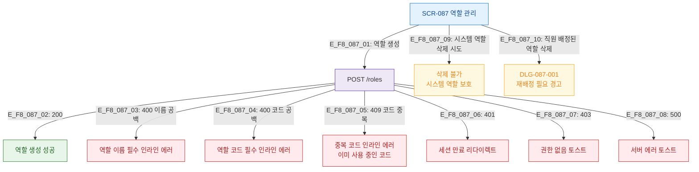

## 다이어그램

```mermaid
flowchart TD
    SCR087[SCR-087 역할 관리]

    SCR087 -->|E_F8_087_01: 역할 생성| CreateReq[POST /roles]
    CreateReq -->|E_F8_087_02: 200| CreateOK[역할 생성 성공]
    CreateReq -->|E_F8_087_03: 400 이름 공백| E_Name[역할 이름 필수 인라인 에러]
    CreateReq -->|E_F8_087_04: 400 코드 공백| E_Code[역할 코드 필수 인라인 에러]
    CreateReq -->|E_F8_087_05: 409 코드 중복| E_DupCode[중복 코드 인라인 에러\n이미 사용 중인 코드]
    CreateReq -->|E_F8_087_06: 401| E_Auth[세션 만료 리다이렉트]
    CreateReq -->|E_F8_087_07: 403| E_Perm[권한 없음 토스트]
    CreateReq -->|E_F8_087_08: 500| E_Server[서버 에러 토스트]

    SCR087 -->|E_F8_087_09: 시스템 역할 삭제 시도| E_SysDelete[삭제 불가\n시스템 역할 보호]
    SCR087 -->|E_F8_087_10: 직원 배정된 역할 삭제| E_StaffAssigned[DLG-087-001\n재배정 필요 경고]

    classDef screen fill:#E3F2FD,stroke:#1976D2,color:#0D47A1
    classDef error fill:#FFEBEE,stroke:#C62828,color:#B71C1C
    classDef success fill:#E8F5E9,stroke:#2E7D32,color:#1B5E20
    classDef warning fill:#FFF8E1,stroke:#F9A825,color:#F57F17
    classDef system fill:#EDE7F6,stroke:#5E35B2
    class SCR087 screen
    class CreateOK success
    class E_StaffAssigned,E_SysDelete warning
    class E_Name,E_Code,E_DupCode,E_Auth,E_Perm,E_Server error
    class CreateReq system
```

## TC 후보
- TC-087-NEG-002: 코드 중복 → 409 인라인 에러
