## 다이어그램

```mermaid
flowchart TD
    SCR087[SCR-087 역할 관리]

    SCR087 -->|"F9_087_01: 역할 생성 성공"|T_CreateOK[토스트 success\n역할이 생성되었습니다]
    SCR087 -->|"F9_087_02: 역할 수정 성공"|T_UpdateOK[토스트 success\n역할이 수정되었습니다]
    SCR087 -->|"F9_087_03: 역할 삭제 성공"|T_DeleteOK[토스트 success\n역할이 삭제되었습니다]

    SCR087 -->|"F9_087_04: 역할 이름 공백"|T_NameErr[인라인 에러\n역할 이름을 입력해 주세요]
    SCR087 -->|"F9_087_05: 역할 코드 공백"|T_CodeErr[인라인 에러\n역할 코드를 입력해 주세요]
    SCR087 -->|"F9_087_06: 코드 중복"|T_DupCode[인라인 에러\n이미 사용 중인 코드입니다]
    SCR087 -->|"F9_087_07: 시스템 역할 삭제 시도"|T_SysLock[토스트 warning\n시스템 역할은 삭제할 수 없습니다]

    SCR087 -->|"F9_087_08: 401"|T_Auth[토스트 error\n세션이 만료되었습니다]
    SCR087 -->|"F9_087_09: 403"|T_Perm[토스트 error\n권한이 없습니다]
    SCR087 -->|"F9_087_10: 500"|T_Server[토스트 error\n일시적 오류입니다]

    classDef screen fill:#E3F2FD,stroke:#1976D2,color:#0D47A1
    classDef success fill:#E8F5E9,stroke:#2E7D32,color:#1B5E20
    classDef warning fill:#FFF8E1,stroke:#F9A825,color:#F57F17
    classDef error fill:#FFEBEE,stroke:#C62828,color:#B71C1C
    class SCR087 screen
    class T_CreateOK,T_UpdateOK,T_DeleteOK success
    class T_SysLock warning
    class T_NameErr,T_CodeErr,T_DupCode,T_Auth,T_Perm,T_Server error
```

## 토스트 메시지 목록
| ID | 트리거 | 타입 | 메시지 | |----|--------|------|--------| | F9_087_01 | 역할 생성 성공 | success | 역할이 생성되었습니다 | | F9_087_02 | 역할 수정 성공 | success | 역할이 수정되었습니다 | | F9_087_03 | 역할 삭제 성공 | success | 역할이 삭제되었습니다 | | F9_087_04 | 이름 공백 | error(inline) | 역할 이름을 입력해 주세요 | | F9_087_05 | 코드 공백 | error(inline) | 역할 코드를 입력해 주세요 | | F9_087_06 | 코드 중복 | error(inline) | 이미 사용 중인 코드입니다 | | F9_087_07 | 시스템 역할 삭제 시도 | warning | 시스템 역할은 삭제할 수 없습니다 | | F9_087_08 | 401 | error | 세션이 만료되었습니다 | | F9_087_09 | 403 | error | 권한이 없습니다 | | F9_087_10 | 500 | error | 일시적 오류입니다 |
