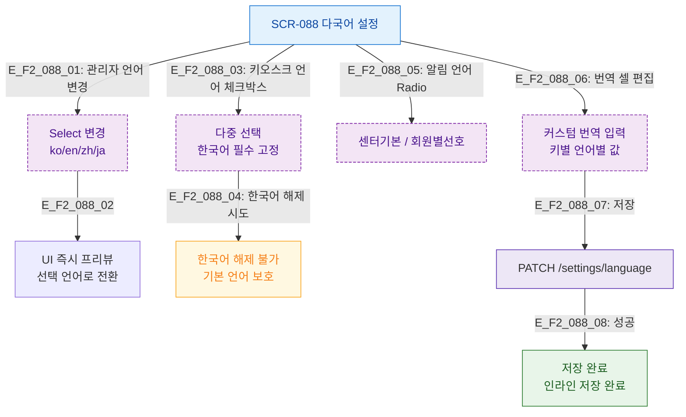

## 다이어그램

```mermaid
flowchart TD
    SCR088[SCR-088 다국어 설정]

    SCR088 -->|"E_F2_088_01: 관리자 언어 변경"| AdminLangChange[Select 변경\nko/en/zh/ja]
    AdminLangChange -->|E_F2_088_02| PreviewUI[UI 즉시 프리뷰\n선택 언어로 전환]

    SCR088 -->|"E_F2_088_03: 키오스크 언어 체크박스"| KioskToggle[다중 선택\n한국어 필수 고정]
    KioskToggle -->|"E_F2_088_04: 한국어 해제 시도"| E_KoRequired[한국어 해제 불가\n기본 언어 보호]

    SCR088 -->|"E_F2_088_05: 알림 언어 Radio"| NotifyMode[센터기본 / 회원별선호]

    SCR088 -->|"E_F2_088_06: 번역 셀 편집"| TransEdit[커스텀 번역 입력\n키별 언어별 값]
    TransEdit -->|"E_F2_088_07: 저장"| ACT_Save[PATCH /settings/language]
    ACT_Save -->|"E_F2_088_08: 성공"| SaveOK[저장 완료\n인라인 저장 완료]

    classDef screen fill:#E3F2FD,stroke:#1976D2,color:#0D47A1
    classDef newFeature fill:#F3E5F5,stroke:#7B1FA2,color:#4A148C,stroke-dasharray:4 2
    classDef success fill:#E8F5E9,stroke:#2E7D32,color:#1B5E20
    classDef warning fill:#FFF8E1,stroke:#F9A825,color:#F57F17
    classDef system fill:#EDE7F6,stroke:#5E35B2
    class SCR088 screen
    class AdminLangChange,KioskToggle,NotifyMode,TransEdit newFeature
    class SaveOK success
    class E_KoRequired warning
    class ACT_Save system
```

## TC 후보
- TC-088-002: 관리자 언어 변경 → UI 즉시 프리뷰
- TC-088-003: 한국어 키오스크 언어 해제 시도 → 불가 경고
