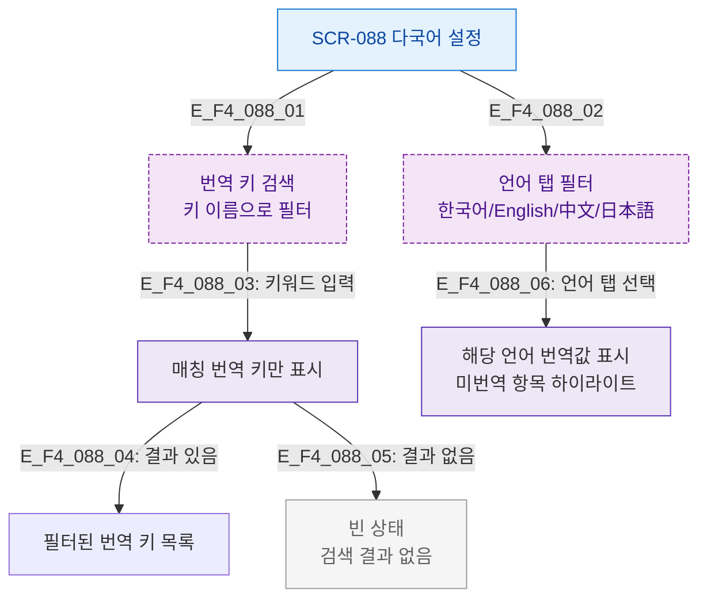

## 다이어그램

```mermaid
flowchart TD
    SCR088[SCR-088 다국어 설정]

    SCR088 -->|E_F4_088_01| SearchKey[번역 키 검색\n키 이름으로 필터]
    SCR088 -->|E_F4_088_02| LangFilter[언어 탭 필터\n한국어/English/中文/日本語]

    SearchKey -->|E_F4_088_03: 키워드 입력| SearchApply[매칭 번역 키만 표시]
    SearchApply -->|E_F4_088_04: 결과 있음| ResultList[필터된 번역 키 목록]
    SearchApply -->|E_F4_088_05: 결과 없음| EmptySearch[빈 상태\n검색 결과 없음]

    LangFilter -->|E_F4_088_06: 언어 탭 선택| LangView[해당 언어 번역값 표시\n미번역 항목 하이라이트]

    classDef screen fill:#E3F2FD,stroke:#1976D2,color:#0D47A1
    classDef newFeature fill:#F3E5F5,stroke:#7B1FA2,color:#4A148C,stroke-dasharray:4 2
    classDef system fill:#EDE7F6,stroke:#5E35B2
    classDef rbacBlocked fill:#F5F5F5,stroke:#9E9E9E,color:#616161
    class SCR088 screen
    class SearchKey,LangFilter newFeature
    class SearchApply,LangView system
    class EmptySearch rbacBlocked
```

## TC 후보
- TC-088-004: 번역 키 검색 → 매칭 키만 표시
