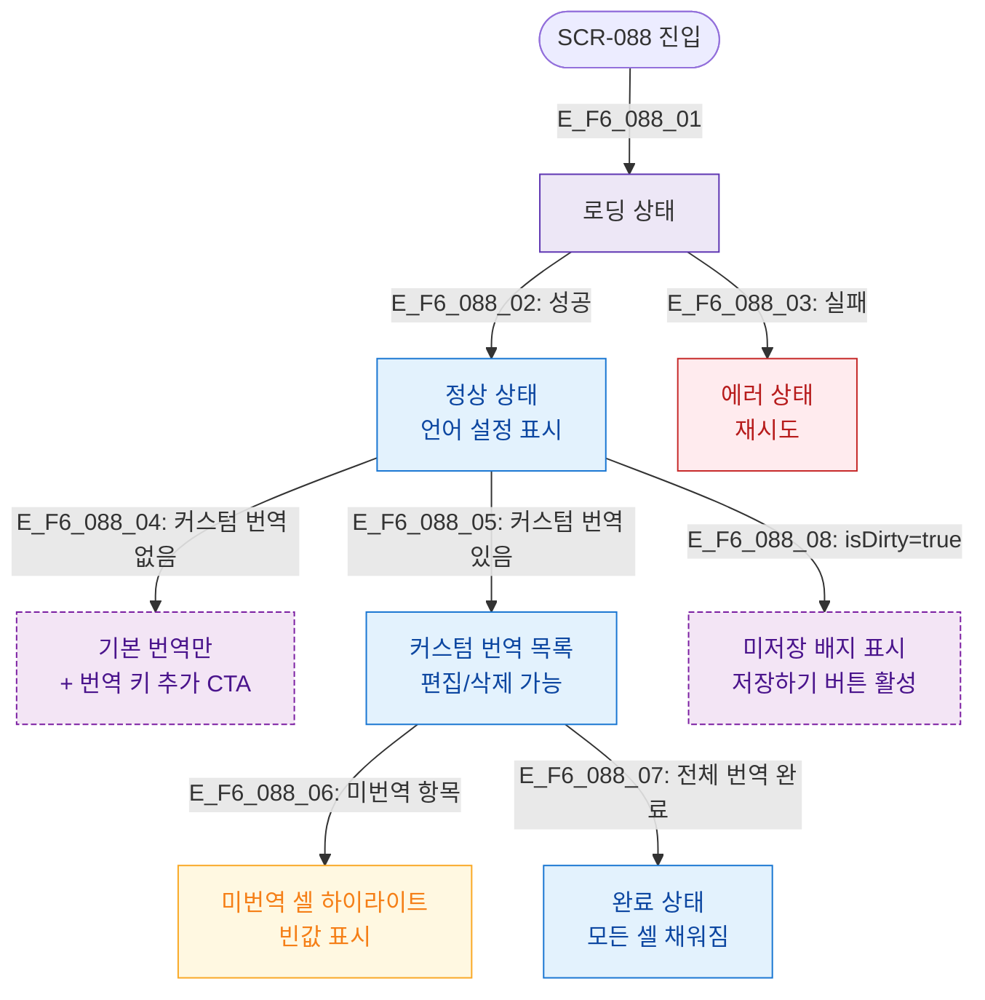

## 다이어그램

```mermaid
flowchart TD
    Entry([SCR-088 진입]) -->|E_F6_088_01| Loading[로딩 상태]
    Loading -->|E_F6_088_02: 성공| Normal[정상 상태\n언어 설정 표시]
    Loading -->|E_F6_088_03: 실패| ErrorState[에러 상태\n재시도]

    Normal -->|E_F6_088_04: 커스텀 번역 없음| DefaultOnly[기본 번역만\n+ 번역 키 추가 CTA]
    Normal -->|E_F6_088_05: 커스텀 번역 있음| HasCustom[커스텀 번역 목록\n편집/삭제 가능]

    HasCustom -->|E_F6_088_06: 미번역 항목| Untranslated[미번역 셀 하이라이트\n빈값 표시]
    HasCustom -->|E_F6_088_07: 전체 번역 완료| FullyTranslated[완료 상태\n모든 셀 채워짐]

    Normal -->|E_F6_088_08: isDirty=true| DirtyBadge[미저장 배지 표시\n저장하기 버튼 활성]

    classDef screen fill:#E3F2FD,stroke:#1976D2,color:#0D47A1
    classDef newFeature fill:#F3E5F5,stroke:#7B1FA2,color:#4A148C,stroke-dasharray:4 2
    classDef error fill:#FFEBEE,stroke:#C62828,color:#B71C1C
    classDef system fill:#EDE7F6,stroke:#5E35B2
    classDef warning fill:#FFF8E1,stroke:#F9A825,color:#F57F17
    class Normal,HasCustom,FullyTranslated screen
    class DefaultOnly,DirtyBadge newFeature
    class ErrorState error
    class Loading system
    class Untranslated warning
```

## TC 후보
- TC-088-005: 커스텀 번역 없음 → 기본 번역만 + 추가 CTA
