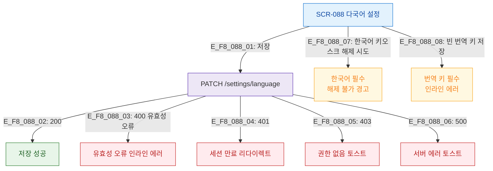

## 다이어그램

```mermaid
flowchart TD
    SCR088[SCR-088 다국어 설정]

    SCR088 -->|E_F8_088_01: 저장| SaveReq[PATCH /settings/language]
    SaveReq -->|E_F8_088_02: 200| SaveOK[저장 성공]
    SaveReq -->|E_F8_088_03: 400 유효성 오류| E_Validation[유효성 오류 인라인 에러]
    SaveReq -->|E_F8_088_04: 401| E_Auth[세션 만료 리다이렉트]
    SaveReq -->|E_F8_088_05: 403| E_Perm[권한 없음 토스트]
    SaveReq -->|E_F8_088_06: 500| E_Server[서버 에러 토스트]

    SCR088 -->|E_F8_088_07: 한국어 키오스크 해제 시도| E_KoRequired[한국어 필수\n해제 불가 경고]
    SCR088 -->|E_F8_088_08: 빈 번역 키 저장| E_EmptyKey[번역 키 필수\n인라인 에러]

    classDef screen fill:#E3F2FD,stroke:#1976D2,color:#0D47A1
    classDef error fill:#FFEBEE,stroke:#C62828,color:#B71C1C
    classDef success fill:#E8F5E9,stroke:#2E7D32,color:#1B5E20
    classDef warning fill:#FFF8E1,stroke:#F9A825,color:#F57F17
    classDef system fill:#EDE7F6,stroke:#5E35B2
    class SCR088 screen
    class SaveOK success
    class E_KoRequired,E_EmptyKey warning
    class E_Validation,E_Auth,E_Perm,E_Server error
    class SaveReq system
```

## TC 후보
- TC-088-NEG-002: 한국어 키오스크 언어 해제 시도 → 해제 불가 경고
