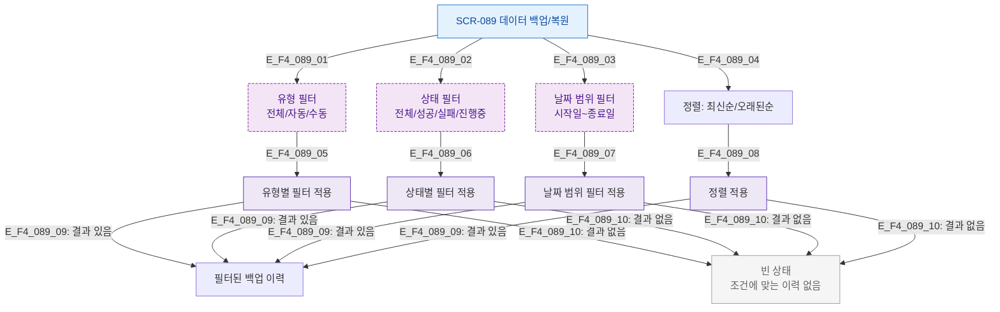

## 다이어그램

```mermaid
flowchart TD
    SCR089[SCR-089 데이터 백업/복원]

    SCR089 -->|E_F4_089_01| TypeFilter[유형 필터\n전체/자동/수동]
    SCR089 -->|E_F4_089_02| StatusFilter[상태 필터\n전체/성공/실패/진행중]
    SCR089 -->|E_F4_089_03| DateRange[날짜 범위 필터\n시작일~종료일]
    SCR089 -->|E_F4_089_04| SortDate[정렬: 최신순/오래된순]

    TypeFilter -->|E_F4_089_05| Apply1[유형별 필터 적용]
    StatusFilter -->|E_F4_089_06| Apply2[상태별 필터 적용]
    DateRange -->|E_F4_089_07| Apply3[날짜 범위 필터 적용]
    SortDate -->|E_F4_089_08| Apply4[정렬 적용]

    Apply1 & Apply2 & Apply3 & Apply4 -->|"E_F4_089_09: 결과 있음"| ResultList[필터된 백업 이력]
    Apply1 & Apply2 & Apply3 & Apply4 -->|"E_F4_089_10: 결과 없음"| EmptyState[빈 상태\n조건에 맞는 이력 없음]

    classDef screen fill:#E3F2FD,stroke:#1976D2,color:#0D47A1
    classDef newFeature fill:#F3E5F5,stroke:#7B1FA2,color:#4A148C,stroke-dasharray:4 2
    classDef system fill:#EDE7F6,stroke:#5E35B2
    classDef rbacBlocked fill:#F5F5F5,stroke:#9E9E9E,color:#616161
    class SCR089 screen
    class TypeFilter,StatusFilter,DateRange newFeature
    class Apply1,Apply2,Apply3,Apply4 system
    class EmptyState rbacBlocked
```

## TC 후보
- TC-089-004: 유형 필터 "수동" → 수동 백업만 표시
