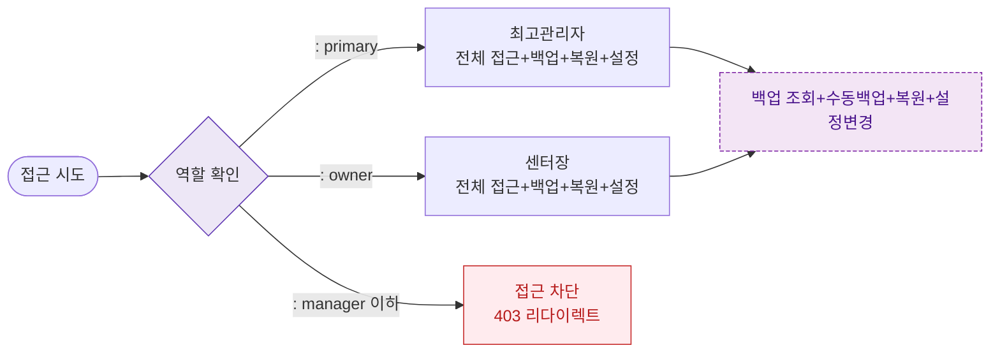

## 다이어그램

## 역할별 접근 매트릭스
| 역할 | 접근 | 조회 | 수동백업 | 복원 | 설정변경 | |------|:---:|:---:|:-------:|:---:|:-------:| | primary | ✅ | ✅ | ✅ | ✅ | ✅ | | owner | ✅ | ✅ | ✅ | ✅ | ✅ | | manager | ❌ | ❌ | ❌ | ❌ | ❌ | | fc | ❌ | ❌ | ❌ | ❌ | ❌ | | staff | ❌ | ❌ | ❌ | ❌ | ❌ | | readonly | ❌ | ❌ | ❌ | ❌ | ❌ |

## TC 후보
- TC-089-NEG-001: manager → → 403 접근 차단
