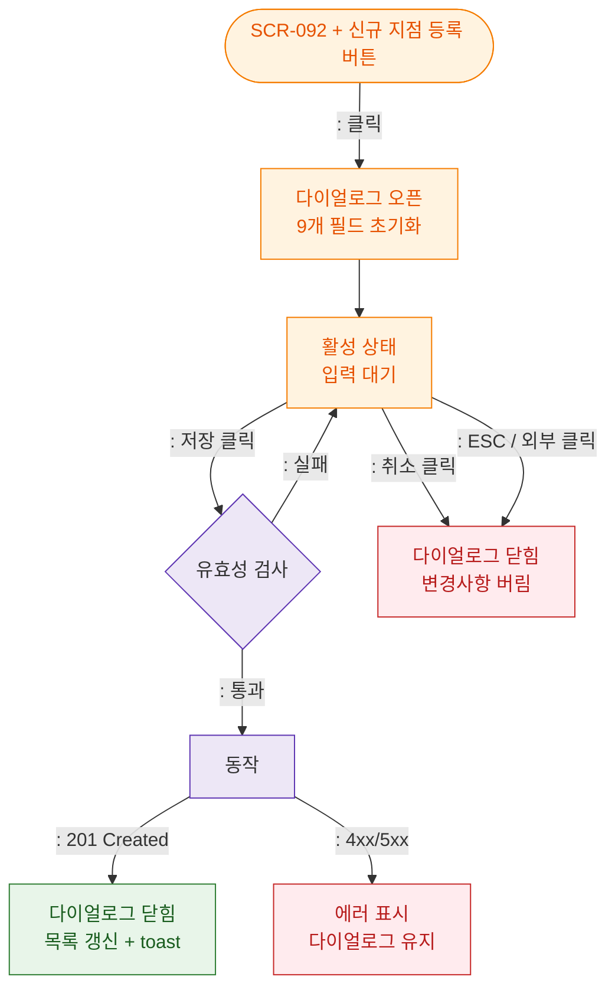

# M1 생명주기 — DLG-092-001 신규 지점 등록

```mermaid
flowchart TD
  Trigger([SCR-092 + 신규 지점 등록 버튼]) -->|": 클릭"|Open[다이얼로그 오픈\n9개 필드 초기화]

  Open --> Active[활성 상태\n입력 대기]
  Active -->|": 저장 클릭"|Validate{유효성 검사}
  Validate -->|": 통과"|Submit[동작]
  Validate -->|": 실패"|Active

  Submit -->|": 201 Created"|Success[다이얼로그 닫힘\n목록 갱신 + toast]
  Submit -->|": 4xx/5xx"|Error[에러 표시\n다이얼로그 유지]

  Active -->|": 취소 클릭"|Cancel[다이얼로그 닫힘\n변경사항 버림]
  Active -->|": ESC / 외부 클릭"|Cancel

  classDef trigger fill:#FFF3E0,stroke:#F57C00,color:#E65100
  classDef modal fill:#FFF3E0,stroke:#F57C00,color:#E65100
  classDef system fill:#EDE7F6,stroke:#5E35B2
  classDef success fill:#E8F5E9,stroke:#2E7D32,color:#1B5E20
  classDef error fill:#FFEBEE,stroke:#C62828,color:#B71C1C

  class Trigger trigger
  class Open,Active modal
  class Validate,Submit system
  class Success success
  class Error,Cancel error
```

## TC 후보

| TC ID | 타입 | Given | When | Then | |-------|:----:|-------|------|------| | TC-092-DLG-001 | P1 positive | 신규 지점 등록 다이얼로그 | 저장 성공 | 다이얼로그 닫힘 + 목록 갱신 |
