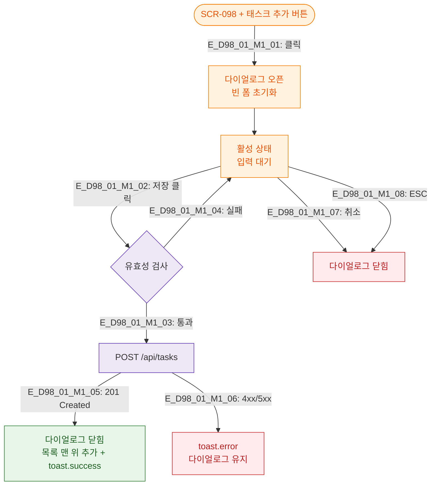

# M1 생명주기 — DLG-098-001 태스크 추가

## TC 후보

| TC ID | 타입 | Given | When | Then |
|-------|:----:|-------|------|------|
| TC-098-DLG-001 | P1 positive | 태스크 추가 다이얼로그 | 저장 성공 | 목록 맨 위 추가 + toast.success |
