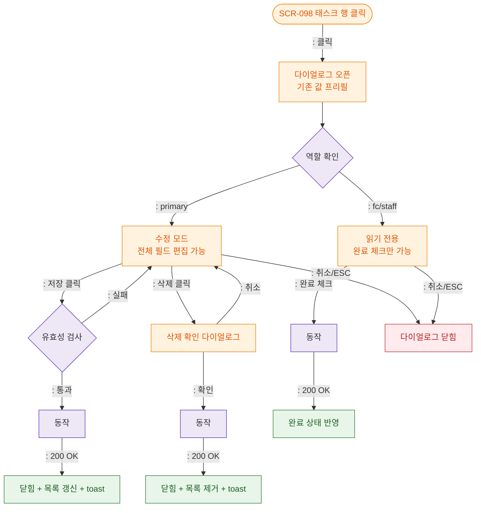

# M1 생명주기 — DLG-098-002 태스크 상세/수정

## TC 후보

| TC ID | 타입 | Given | When | Then | |-------|:----:|-------|------|------| | TC-098-DLG-005 | P1 positive | fc 역할 태스크 클릭 | 다이얼로그 열림 | 읽기 전용 + 완료 체크만 노출 |
