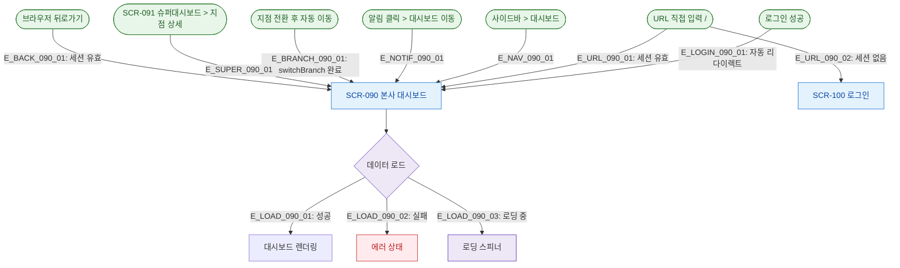

# F1 진입 플로우 — SCR-090 본사 대시보드

## 엣지 설명

| 엣지 ID | 출발 | 도착 | 조건 |
|---------|------|------|------|
| E_LOGIN_090_01 | 로그인 성공 | SCR-090 | 로그인 후 자동 리다이렉트 |
| E_URL_090_01 | URL 직접 입력 | SCR-090 | 세션 유효 |
| E_URL_090_02 | URL 직접 입력 | SCR-100 | 세션 없음 → 로그인 리다이렉트 |
| E_NAV_090_01 | 사이드바 | SCR-090 | 전 역할 접근 가능 |
| E_NOTIF_090_01 | 알림 | SCR-090 | 딥링크 |
| E_BRANCH_090_01 | 지점 전환 | SCR-090 | switchBranch 완료 후 router.push('/') |
| E_SUPER_090_01 | SCR-091 | SCR-090 | 지점 상세 버튼 |
| E_BACK_090_01 | 브라우저 뒤로가기 | SCR-090 | 세션 유효 시 |

## TC 후보

| TC ID | 타입 | Given | When | Then |
|-------|:----:|-------|------|------|
| TC-090-001 | P0 positive | 로그인 성공 | 자동 이동 | 대시보드 렌더링 |
| TC-090-F1-001 | P1 negative | 세션 없음 | URL 직접 입력 | /login 리다이렉트 |
| TC-090-F1-002 | P1 positive | 지점 전환 완료 | switchBranch | 해당 지점 대시보드 로드 |
