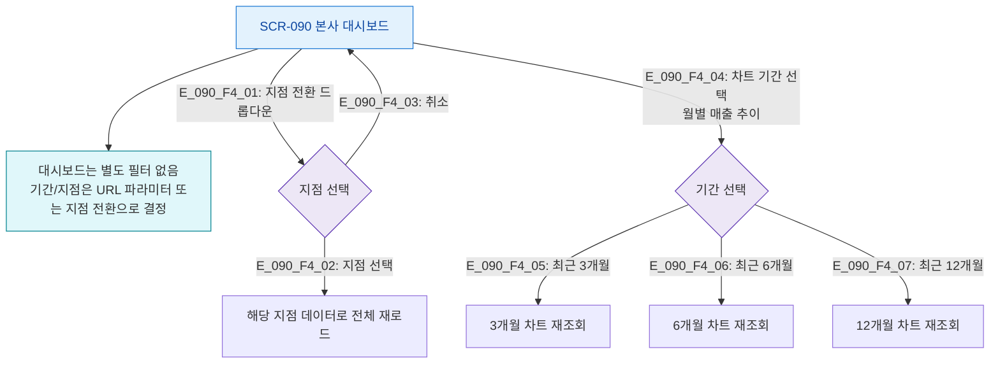

# F4 필터/검색/정렬 플로우 — SCR-090 본사 대시보드

## TC 후보

| TC ID | 타입 | Given | When | Then |
|-------|:----:|-------|------|------|
| TC-090-F4-001 | P2 positive | 멀티지점 계정 | 지점 전환 | 해당 지점 데이터 전체 재로드 |
| TC-090-F4-002 | P2 positive | 차트 표시 중 | 기간 3개월 선택 | 최근 3개월 데이터로 재조회 |
