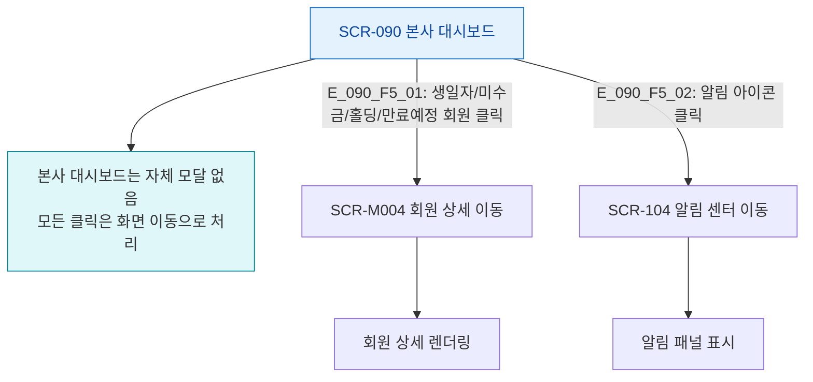

# F5 모달 트리거 트리 — SCR-090 본사 대시보드

```mermaid
flowchart TD
  SCR_090[SCR-090 본사 대시보드]

  SCR_090 --> NoModal[본사 대시보드는 자체 모달 없음\n모든 클릭은 화면 이동으로 처리]

  SCR_090 -->|"E_090_F5_01: 생일자/미수금/홀딩/만료예정 회원 클릭"| NavMember[SCR-M004 회원 상세 이동]
  SCR_090 -->|"E_090_F5_02: 알림 아이콘 클릭"| NavNotif[SCR-104 알림 센터 이동]

  NavMember --> MemberDetail[회원 상세 렌더링]
  NavNotif --> NotifPanel[알림 패널 표시]

  classDef screen fill:#E3F2FD,stroke:#1976D2,color:#0D47A1
  classDef info fill:#E0F7FA,stroke:#00838F

  class SCR_090 screen
  class NoModal info
```

## TC 후보

| TC ID | 타입 | Given | When | Then |
|-------|:----:|-------|------|------|
| TC-090-F5-001 | P1 positive | 미수금 회원 존재 | 위젯 클릭 | 회원 상세 화면 이동 (모달 아님) |
