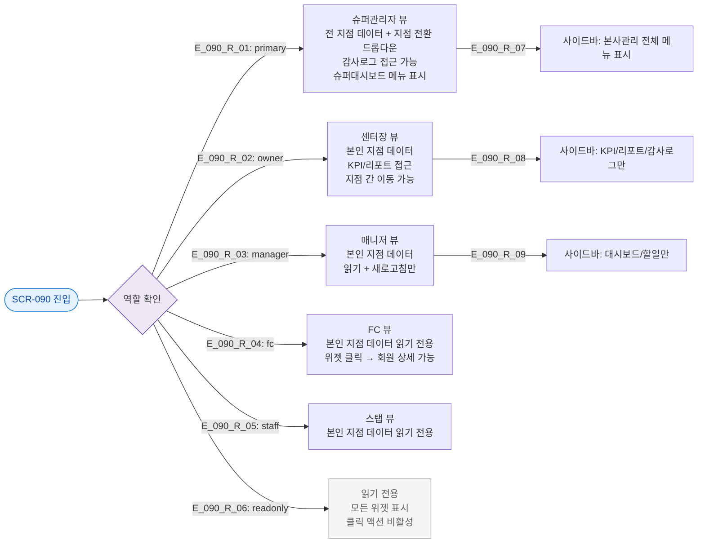

# F7 권한(RBAC) 분기 플로우 — SCR-090 본사 대시보드

## TC 후보

| TC ID | 타입 | Given | When | Then |
|-------|:----:|-------|------|------|
| TC-090-F7-001 | P0 positive | primary 로그인 | 대시보드 진입 | 지점 전환 드롭다운 + 본사관리 전체 메뉴 |
| TC-090-F7-002 | P1 positive | readonly 로그인 | 위젯 클릭 시도 | 클릭 비활성 또는 읽기 전용 표시 |
| TC-090-F7-003 | P1 positive | manager 로그인 | 대시보드 진입 | 슈퍼대시보드 메뉴 미표시 |
