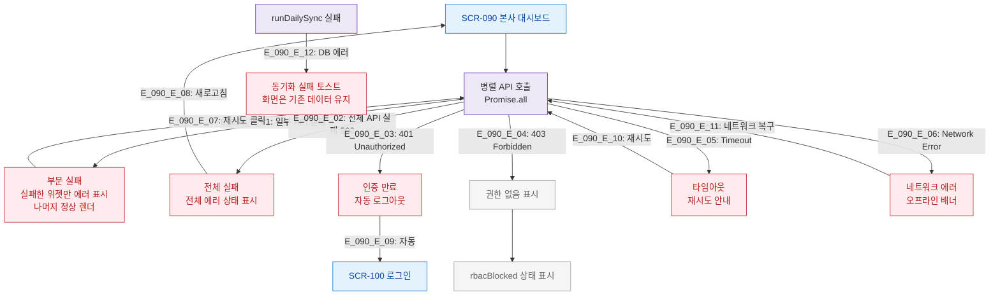

# F8 에러/예외/복구 플로우 — SCR-090 본사 대시보드

## TC 후보

| TC ID | 타입 | Given | When | Then |
|-------|:----:|-------|------|------|
| TC-090-F8-001 | P1 negative | 대시보드 로드 중 | API 500 | 에러 상태 + 새로고침 안내 |
| TC-090-F8-002 | P0 negative | 세션 만료 | API 호출 | 자동 /login 리다이렉트 |
| TC-090-F8-003 | P2 exception | 네트워크 없음 | 진입 시도 | 오프라인 배너 표시 |
