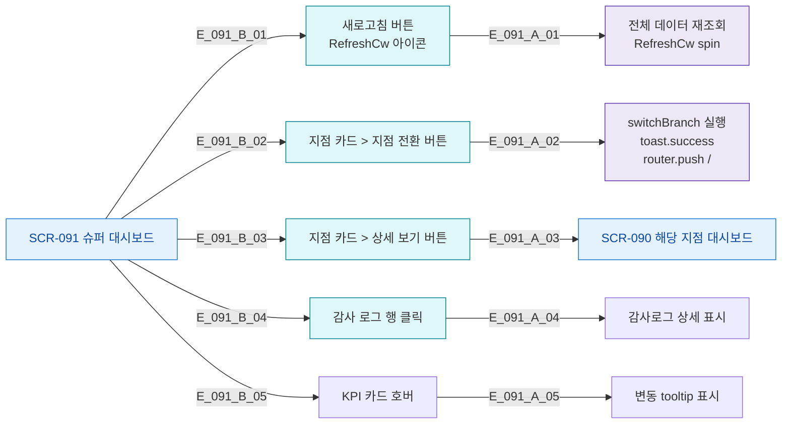

# F3 버튼/액션 매핑 — SCR-091 슈퍼 대시보드

## TC 후보

| TC ID | 타입 | Given | When | Then |
|-------|:----:|-------|------|------|
| TC-091-006 | P0 positive | 지점 카드 표시 | 전환 버튼 클릭 | toast.success + / 이동 |
| TC-091-010 | P1 positive | 데이터 로드 완료 | 새로고침 클릭 | spin 애니메이션 |
