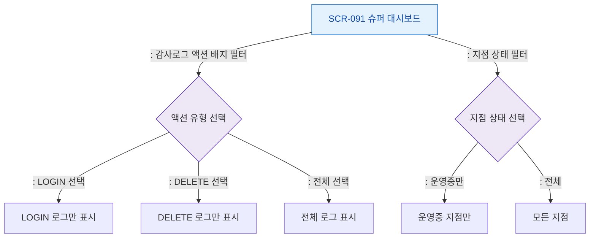

# F4 필터/검색 플로우 — SCR-091 슈퍼 대시보드

```mermaid
flowchart TD
  SCR_091[SCR-091 슈퍼 대시보드]

  SCR_091 -->|": 감사로그 액션 배지 필터"|AuditFilter{액션 유형 선택}
  AuditFilter -->|": LOGIN 선택"|FilterLogin[LOGIN 로그만 표시]
  AuditFilter -->|": DELETE 선택"|FilterDelete[DELETE 로그만 표시]
  AuditFilter -->|": 전체 선택"|FilterAll[전체 로그 표시]

  SCR_091 -->|": 지점 상태 필터"|BranchFilter{지점 상태 선택}
  BranchFilter -->|": 운영중만"|ActiveOnly[운영중 지점만]
  BranchFilter -->|": 전체"|AllBranches[모든 지점]

  classDef screen fill:#E3F2FD,stroke:#1976D2,color:#0D47A1
  classDef system fill:#EDE7F6,stroke:#5E35B2

  class SCR_091 screen
  class AuditFilter,BranchFilter system
```

## TC 후보

| TC ID | 타입 | Given | When | Then | |-------|:----:|-------|------|------| | TC-091-F4-001 | P2 positive | 감사로그 표시 | LOGIN 필터 | LOGIN 액션만 표시 |
