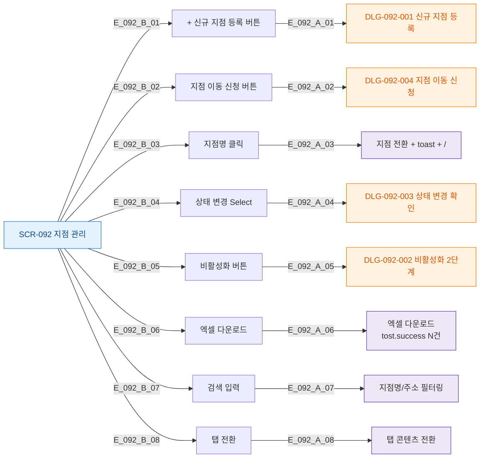

# F3 버튼/액션 매핑 — SCR-092 지점 관리

## TC 후보

| TC ID | 타입 | Given | When | Then |
|-------|:----:|-------|------|------|
| TC-092-002 | P0 positive | 신규 등록 버튼 | 필수 필드 입력 + 저장 | toast.success 등록 완료 |
| TC-092-013 | P1 positive | 지점 목록 | 엑셀 버튼 | 다운로드 + toast |
