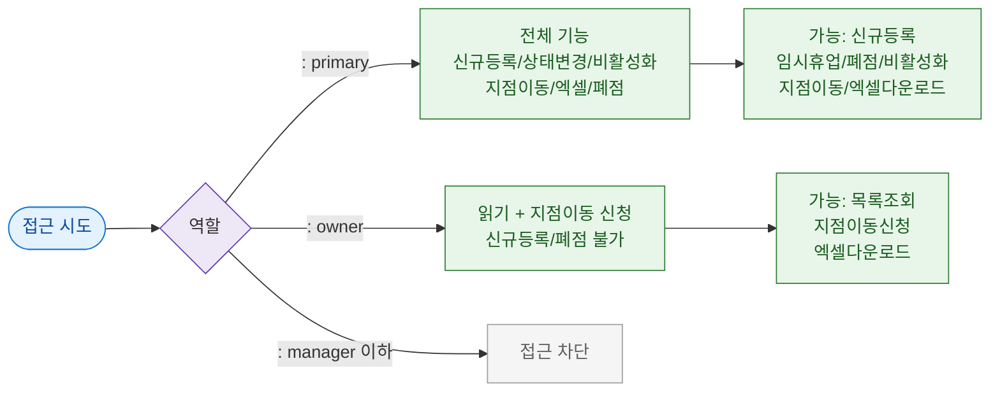

# F7 권한(RBAC) 분기 플로우 — SCR-092 지점 관리

## TC 후보

| TC ID | 타입 | Given | When | Then | |-------|:----:|-------|------|------| | TC-092-F7-001 | P0 positive | primary | 지점 신규 등록 버튼 | 모달 열림 | | TC-092-F7-002 | P0 negative | owner | 지점 폐점 시도 | 버튼 비활성 또는 권한없음 |
