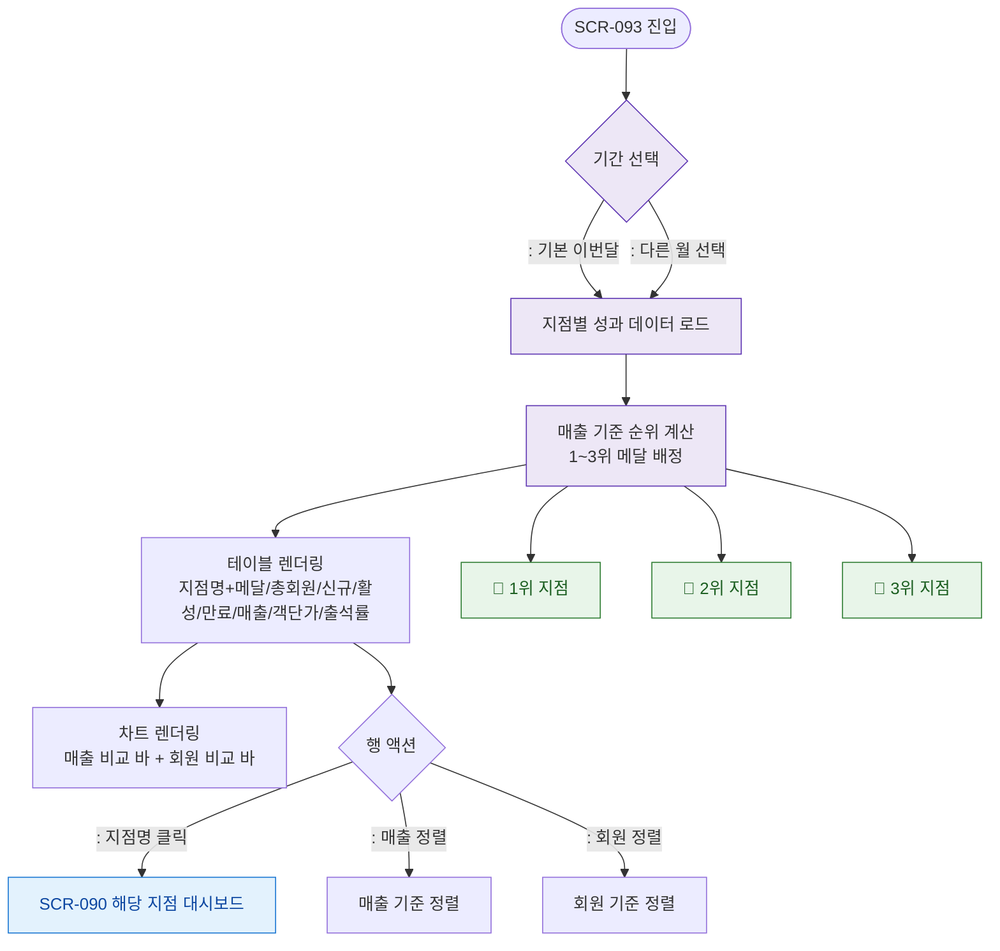

# F2 메인 인터랙션 플로우 — SCR-093 지점 성과 리포트

## TC 후보

| TC ID | 타입 | Given | When | Then | |-------|:----:|-------|------|------| | TC-093-F2-001 | P0 positive | 지점 3개 이상 | 리포트 로드 | 1~3위 메달 표시 + 테이블 | | TC-093-F2-002 | P1 positive | 테이블 렌더 | 지점명 클릭 | SCR-090 이동 | | TC-093-F2-003 | P1 positive | 테이블 렌더 | 매출 정렬 클릭 | 매출 내림차순 정렬 |
