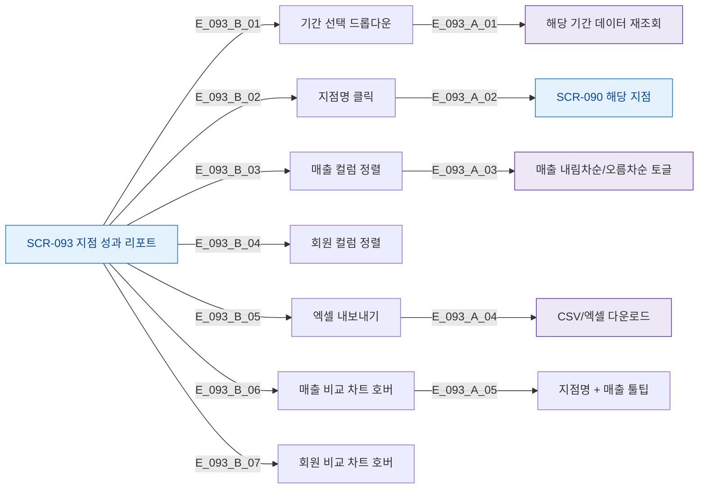

# F3 버튼/액션 매핑 — SCR-093 지점 성과 리포트

```mermaid
flowchart LR
  SCR_093[SCR-093 지점 성과 리포트]

  SCR_093 -->|E_093_B_01| BTN_PERIOD[기간 선택 드롭다운]
  SCR_093 -->|E_093_B_02| BTN_BRANCH_NAME[지점명 클릭]
  SCR_093 -->|E_093_B_03| BTN_SORT_REV[매출 컬럼 정렬]
  SCR_093 -->|E_093_B_04| BTN_SORT_MEM[회원 컬럼 정렬]
  SCR_093 -->|E_093_B_05| BTN_EXCEL[엑셀 내보내기]
  SCR_093 -->|E_093_B_06| BTN_CHART_REV[매출 비교 차트 호버]
  SCR_093 -->|E_093_B_07| BTN_CHART_MEM[회원 비교 차트 호버]

  BTN_PERIOD -->|E_093_A_01| ACT_LOAD[해당 기간 데이터 재조회]
  BTN_BRANCH_NAME -->|E_093_A_02| SCR_090[SCR-090 해당 지점]
  BTN_SORT_REV -->|E_093_A_03| ACT_SORT[매출 내림차순/오름차순 토글]
  BTN_EXCEL -->|E_093_A_04| ACT_EXCEL[CSV/엑셀 다운로드]
  BTN_CHART_REV -->|E_093_A_05| TOOLTIP[지점명 + 매출 툴팁]

  classDef screen fill:#E3F2FD,stroke:#1976D2,color:#0D47A1
  classDef system fill:#EDE7F6,stroke:#5E35B2

  class SCR_093,SCR_090 screen
  class ACT_LOAD,ACT_SORT,ACT_EXCEL system
```

## TC 후보

| TC ID | 타입 | Given | When | Then |
|-------|:----:|-------|------|------|
| TC-093-F3-001 | P1 positive | 리포트 표시 | 매출 정렬 | 내림차순 재정렬 |
