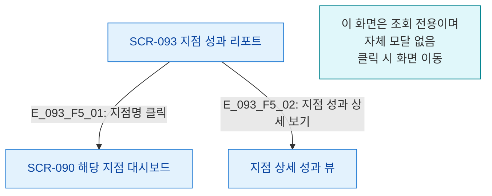

# F5 모달 트리거 트리 — SCR-093 지점 성과 리포트

```mermaid
flowchart TD
  SCR_093[SCR-093 지점 성과 리포트]
  Note[이 화면은 조회 전용이며\n자체 모달 없음\n클릭 시 화면 이동]

  SCR_093 -->|E_093_F5_01: 지점명 클릭| SCR_090[SCR-090 해당 지점 대시보드]
  SCR_093 -->|E_093_F5_02: 지점 성과 상세 보기| SCR_093_Detail[지점 상세 성과 뷰]

  classDef screen fill:#E3F2FD,stroke:#1976D2,color:#0D47A1
  classDef info fill:#E0F7FA,stroke:#00838F

  class SCR_093,SCR_090,SCR_093_Detail screen
  class Note info
```

## TC 후보

| TC ID | 타입 | Given | When | Then |
|-------|:----:|-------|------|------|
| TC-093-F5-001 | P1 positive | 지점 리포트 | 지점명 클릭 | SCR-090 이동 |
