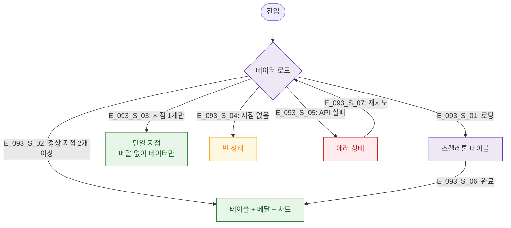

# F6 상태별 화면 플로우 — SCR-093 지점 성과 리포트

## TC 후보

| TC ID | 타입 | Given | When | Then |
|-------|:----:|-------|------|------|
| TC-093-F6-001 | P2 positive | 지점 1개 | 리포트 조회 | 메달 없이 데이터 표시 |
| TC-093-F6-002 | P1 negative | API 실패 | 진입 | 에러 상태 + 재시도 |
