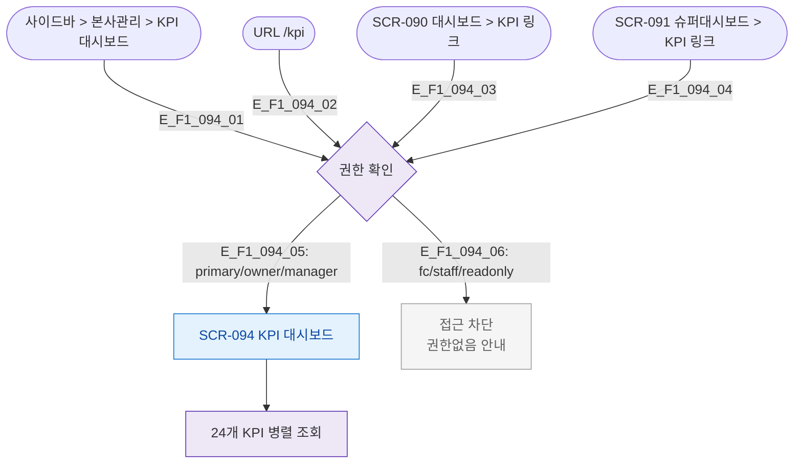

# F1 진입 플로우 — SCR-094 KPI 대시보드

```mermaid
flowchart TD
  E1([사이드바 > 본사관리 > KPI 대시보드]) -->|E_F1_094_01| AuthCheck{권한 확인}
  E2([URL /kpi]) -->|E_F1_094_02| AuthCheck
  E3([SCR-090 대시보드 > KPI 링크]) -->|E_F1_094_03| AuthCheck
  E4([SCR-091 슈퍼대시보드 > KPI 링크]) -->|E_F1_094_04| AuthCheck

  AuthCheck -->|"E_F1_094_05: primary/owner/manager"| SCR_094[SCR-094 KPI 대시보드]
  AuthCheck -->|"E_F1_094_06: fc/staff/readonly"| Blocked[접근 차단\n권한없음 안내]

  SCR_094 --> Load[24개 KPI 병렬 조회]

  classDef screen fill:#E3F2FD,stroke:#1976D2,color:#0D47A1
  classDef system fill:#EDE7F6,stroke:#5E35B2
  classDef rbacBlocked fill:#F5F5F5,stroke:#9E9E9E,color:#616161

  class SCR_094 screen
  class AuthCheck,Load system
  class Blocked rbacBlocked
```

## TC 후보

| TC ID | 타입 | Given | When | Then |
|-------|:----:|-------|------|------|
| TC-094-001 | P0 positive | owner | /kpi 진입 | 24개 KPI 섹션 렌더링 |
