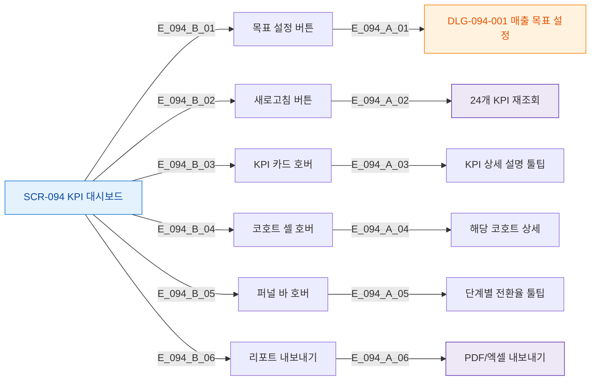

# F3 버튼/액션 매핑 — SCR-094 KPI 대시보드

## TC 후보

| TC ID | 타입 | Given | When | Then |
|-------|:----:|-------|------|------|
| TC-094-002 | P1 positive | 목표 설정 버튼 | 1000만원 입력 + 저장 | toast.success 저장 완료 |
| TC-094-003 | P1 negative | 목표 설정 모달 | 빈 값 저장 | toast.error 올바른 금액 입력 |
