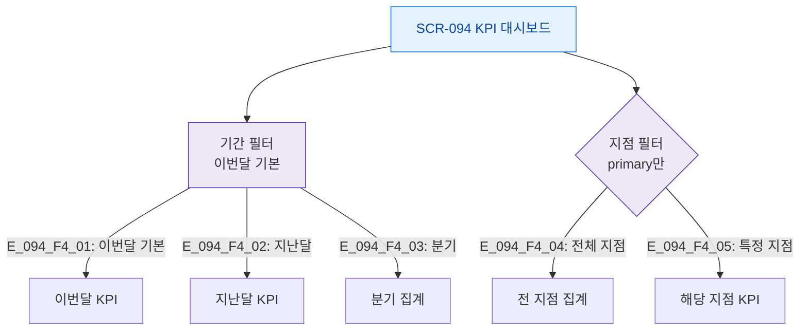

# F4 필터 플로우 — SCR-094 KPI 대시보드

```mermaid
flowchart TD
  SCR_094[SCR-094 KPI 대시보드] --> PeriodFilter[기간 필터\n이번달 기본]

  PeriodFilter -->|E_094_F4_01: 이번달 기본| ThisMonth[이번달 KPI]
  PeriodFilter -->|E_094_F4_02: 지난달| LastMonth[지난달 KPI]
  PeriodFilter -->|E_094_F4_03: 분기| Quarter[분기 집계]

  SCR_094 --> BranchFilter{지점 필터\nprimary만}
  BranchFilter -->|E_094_F4_04: 전체 지점| AllBranch[전 지점 집계]
  BranchFilter -->|E_094_F4_05: 특정 지점| OneBranch[해당 지점 KPI]

  classDef screen fill:#E3F2FD,stroke:#1976D2,color:#0D47A1
  classDef system fill:#EDE7F6,stroke:#5E35B2

  class SCR_094 screen
  class PeriodFilter,BranchFilter system
```

## TC 후보

| TC ID | 타입 | Given | When | Then |
|-------|:----:|-------|------|------|
| TC-094-F4-001 | P2 positive | KPI 표시 | 지난달 선택 | 지난달 기준 KPI 재조회 |
