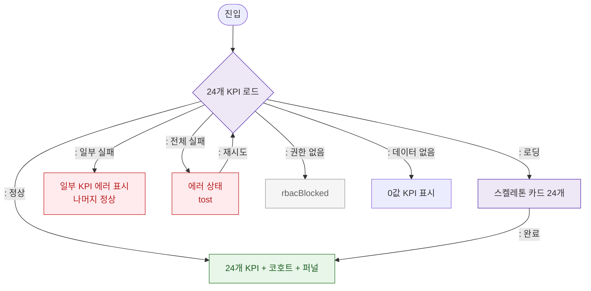

# F6 상태별 화면 플로우 — SCR-094 KPI 대시보드

## TC 후보

| TC ID | 타입 | Given | When | Then | |-------|:----:|-------|------|------| | TC-094-011 | P1 negative | API 에러 | KPI 로드 | toast "KPI 데이터를 불러오지 못했습니다." | | TC-094-F6-001 | P2 positive | 신규 지점 | 진입 | 0값 KPI 표시 |
