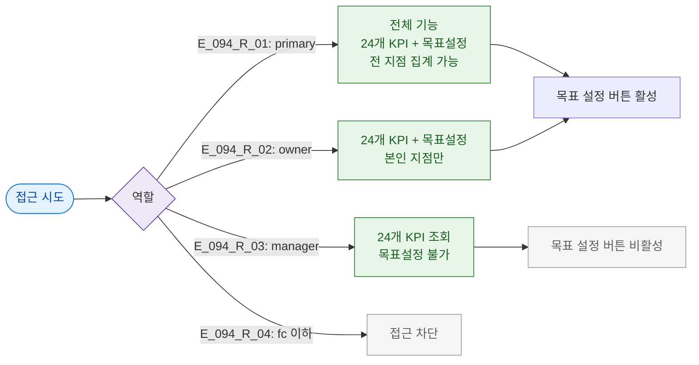

# F7 권한(RBAC) 분기 플로우 — SCR-094 KPI 대시보드

## TC 후보

| TC ID | 타입 | Given | When | Then |
|-------|:----:|-------|------|------|
| TC-094-F7-001 | P0 positive | owner | 목표 설정 버튼 | 모달 열림 |
| TC-094-F7-002 | P1 positive | manager | 목표 설정 버튼 | 비활성 또는 권한없음 |
