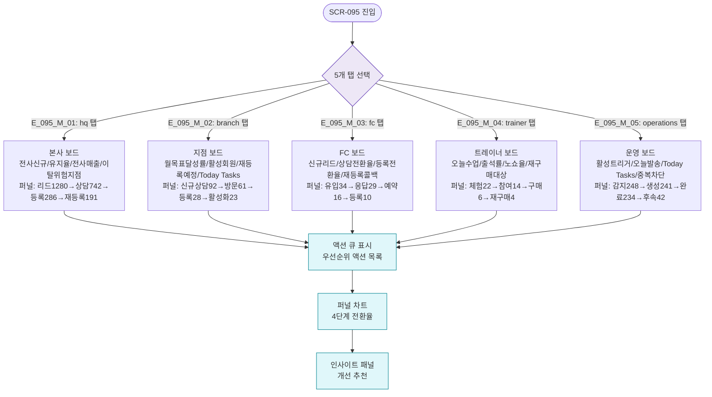

# F2 메인 인터랙션 플로우 — SCR-095 KPI 프리뷰 보드

## TC 후보

| TC ID | 타입 | Given | When | Then |
|-------|:----:|-------|------|------|
| TC-095-F2-001 | P0 positive | primary | hq 탭 | 전사 KPI 4개 + 퍼널 + 인사이트 |
| TC-095-F2-002 | P1 positive | fc 역할 | fc 탭 | FC KPI 4개 + 퍼널 |
| TC-095-F2-003 | P1 positive | 임의 탭 활성 | 다른 탭 클릭 | 해당 탭 콘텐츠로 전환 |
