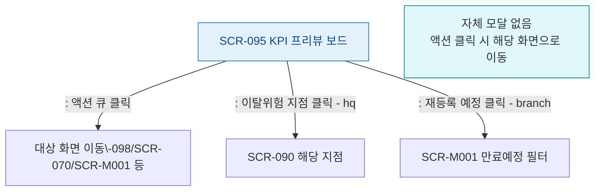

# F5 모달 트리거 트리 — SCR-095 KPI 프리뷰 보드

```mermaid
flowchart TD
  SCR_095[SCR-095 KPI 프리뷰 보드]
  Note[자체 모달 없음\n액션 클릭 시 해당 화면으로 이동]

  SCR_095 -->|": 액션 큐 클릭"|NavTarget[대상 화면 이동\-098/SCR-070/SCR-M001 등]
  SCR_095 -->|": 이탈위험 지점 클릭 - hq"|NavBranch[SCR-090 해당 지점]
  SCR_095 -->|": 재등록 예정 클릭 - branch"|NavMembers[SCR-M001 만료예정 필터]

  classDef screen fill:#E3F2FD,stroke:#1976D2,color:#0D47A1
  classDef info fill:#E0F7FA,stroke:#00838F

  class SCR_095 screen
  class Note info
```

## TC 후보

| TC ID | 타입 | Given | When | Then | |-------|:----:|-------|------|------| | TC-095-F5-001 | P1 positive | branch 탭 | 재등록 예정 클릭 | 회원 목록 만료예정 필터 이동 |
