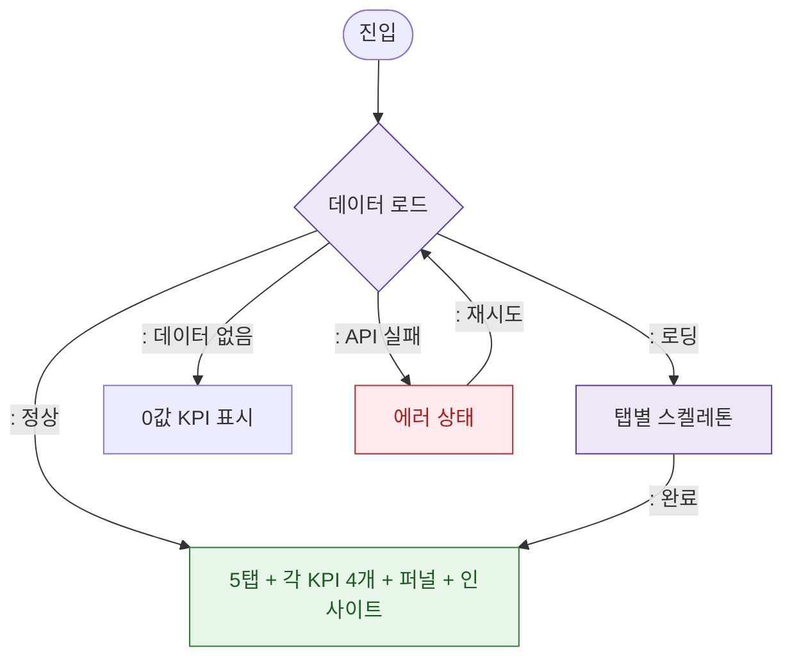

# F6 상태별 화면 플로우 — SCR-095 KPI 프리뷰 보드

```mermaid
flowchart TD
  Entry([진입]) --> Load{데이터 로드}

  Load -->|": 로딩"|Loading[탭별 스켈레톤]
  Load -->|": 정상"|Normal[5탭 + 각 KPI 4개 + 퍼널 + 인사이트]
  Load -->|": 데이터 없음"|Empty[0값 KPI 표시]
  Load -->|": API 실패"|Error[에러 상태]

  Loading -->|": 완료"|Normal
  Error -->|": 재시도"|Load

  classDef screen fill:#E3F2FD,stroke:#1976D2,color:#0D47A1
  classDef system fill:#EDE7F6,stroke:#5E35B2
  classDef error fill:#FFEBEE,stroke:#C62828,color:#B71C1C
  classDef success fill:#E8F5E9,stroke:#2E7D32,color:#1B5E20

  class Normal success
  class Loading,Load system
  class Error error
```

## TC 후보

| TC ID | 타입 | Given | When | Then | |-------|:----:|-------|------|------| | TC-095-F6-001 | P1 negative | API 실패 | 진입 | 에러 상태 + 재시도 |
