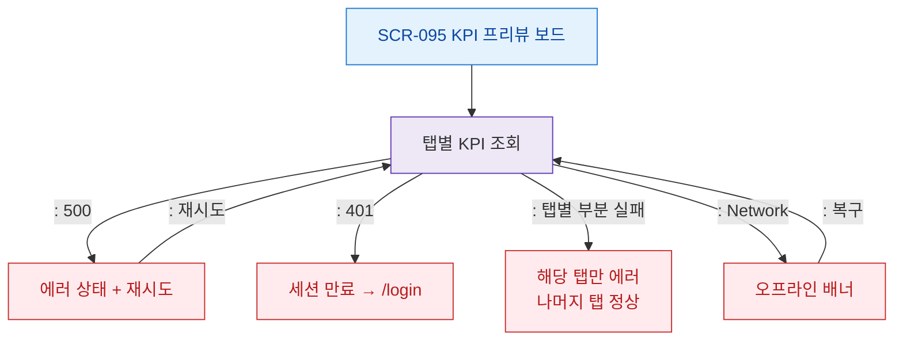

# F8 에러/예외/복구 플로우 — SCR-095 KPI 프리뷰 보드

```mermaid
flowchart TD
  SCR_095[SCR-095 KPI 프리뷰 보드] --> Load[탭별 KPI 조회]

  Load -->|": 500"|ErrServer[에러 상태 + 재시도]
  Load -->|": 401"|ErrAuth[세션 만료 → /login]
  Load -->|": 탭별 부분 실패"|ErrPartial[해당 탭만 에러\n나머지 탭 정상]
  Load -->|": Network"|ErrNet[오프라인 배너]

  ErrServer -->|": 재시도"|Load
  ErrNet -->|": 복구"|Load

  classDef screen fill:#E3F2FD,stroke:#1976D2,color:#0D47A1
  classDef error fill:#FFEBEE,stroke:#C62828,color:#B71C1C
  classDef system fill:#EDE7F6,stroke:#5E35B2

  class SCR_095 screen
  class ErrServer,ErrAuth,ErrPartial,ErrNet error
  class Load system
```

## TC 후보

| TC ID | 타입 | Given | When | Then | |-------|:----:|-------|------|------| | TC-095-F8-001 | P1 negative | API 500 | 진입 | 에러 상태 + 재시도 |
