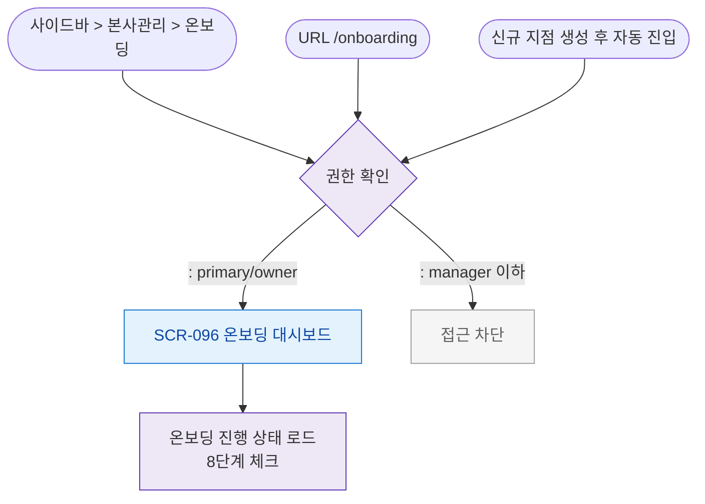

# F1 진입 플로우 — SCR-096 온보딩 대시보드

```mermaid
flowchart TD
  E1([사이드바 > 본사관리 > 온보딩]) --> AuthCheck{권한 확인}
  E2([URL /onboarding]) --> AuthCheck
  E3([신규 지점 생성 후 자동 진입]) --> AuthCheck

  AuthCheck -->|": primary/owner"|SCR_096[SCR-096 온보딩 대시보드]
  AuthCheck -->|": manager 이하"|Blocked[접근 차단]

  SCR_096 --> Progress[온보딩 진행 상태 로드\n8단계 체크]

  classDef screen fill:#E3F2FD,stroke:#1976D2,color:#0D47A1
  classDef system fill:#EDE7F6,stroke:#5E35B2
  classDef rbacBlocked fill:#F5F5F5,stroke:#9E9E9E,color:#616161

  class SCR_096 screen
  class AuthCheck,Progress system
  class Blocked rbacBlocked
```

## TC 후보

| TC ID | 타입 | Given | When | Then | |-------|:----:|-------|------|------| | TC-096-F1-001 | P0 positive | 신규 지점 owner | /onboarding | 8단계 온보딩 화면 |
