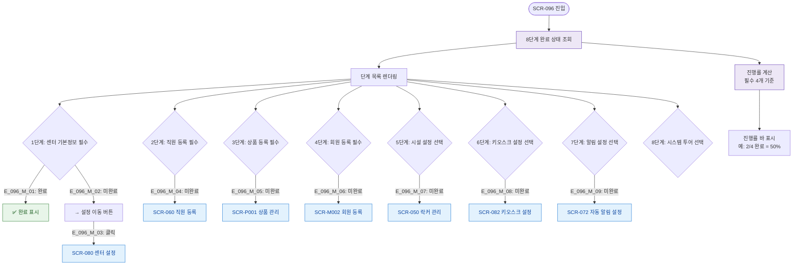

# F2 메인 인터랙션 플로우 — SCR-096 온보딩 대시보드

## TC 후보

| TC ID | 타입 | Given | When | Then |
|-------|:----:|-------|------|------|
| TC-096-F2-001 | P0 positive | 신규 지점 | 온보딩 진입 | 8단계 목록 + 진행률 |
| TC-096-F2-002 | P1 positive | 1단계 미완료 | 설정 버튼 클릭 | SCR-080 이동 |
| TC-096-F2-003 | P1 positive | 필수 4단계 완료 | 진행률 확인 | 100% + 완료 메시지 |
