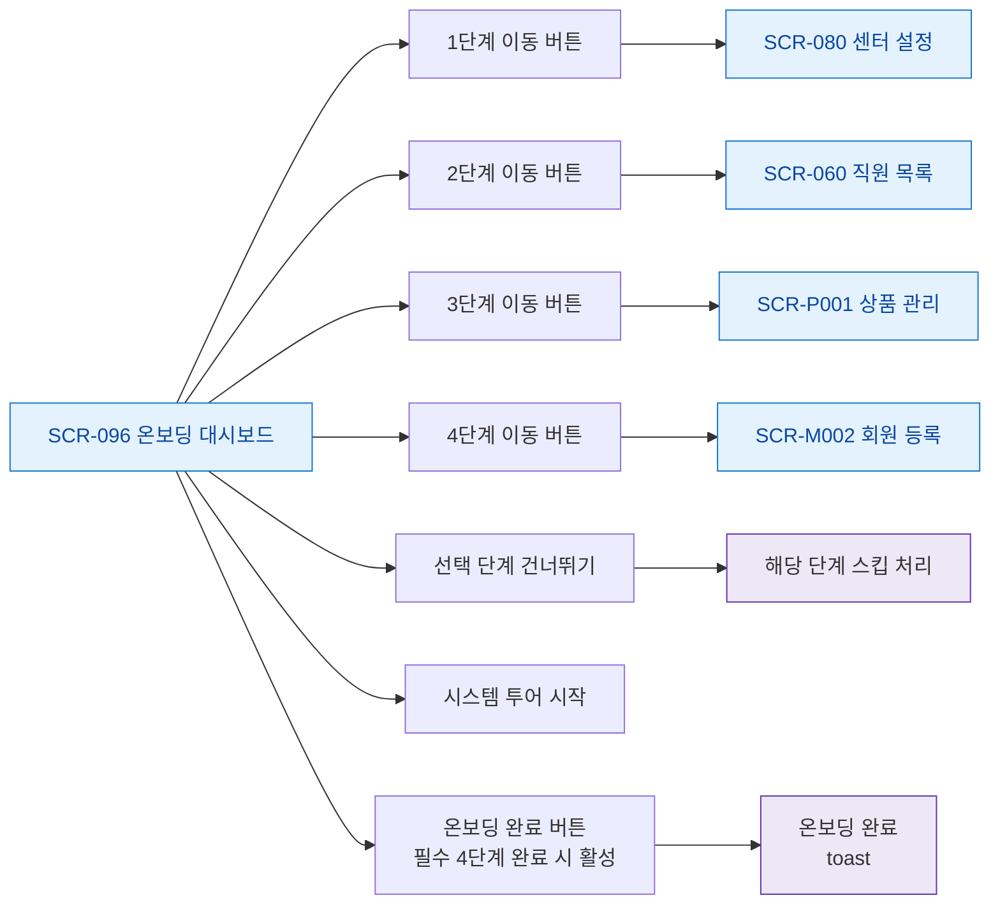

# F3 버튼/액션 매핑 — SCR-096 온보딩 대시보드

```mermaid
flowchart LR
  SCR_096[SCR-096 온보딩 대시보드]

  SCR_096 --> BTN_S1[1단계 이동 버튼]
  SCR_096 --> BTN_S2[2단계 이동 버튼]
  SCR_096 --> BTN_S3[3단계 이동 버튼]
  SCR_096 --> BTN_S4[4단계 이동 버튼]
  SCR_096 --> BTN_SKIP[선택 단계 건너뛰기]
  SCR_096 --> BTN_TOUR[시스템 투어 시작]
  SCR_096 --> BTN_COMPLETE[온보딩 완료 버튼\n필수 4단계 완료 시 활성]

  BTN_S1 --> SCR_080[SCR-080 센터 설정]
  BTN_S2 --> SCR_060[SCR-060 직원 목록]
  BTN_S3 --> SCR_P001[SCR-P001 상품 관리]
  BTN_S4 --> SCR_M002[SCR-M002 회원 등록]
  BTN_SKIP --> ACT_SKIP[해당 단계 스킵 처리]
  BTN_COMPLETE --> ACT_COMPLETE[온보딩 완료\ntoast]

  classDef screen fill:#E3F2FD,stroke:#1976D2,color:#0D47A1
  classDef system fill:#EDE7F6,stroke:#5E35B2

  class SCR_096,SCR_080,SCR_060,SCR_P001,SCR_M002 screen
  class ACT_SKIP,ACT_COMPLETE system
```

## TC 후보

| TC ID | 타입 | Given | When | Then | |-------|:----:|-------|------|------| | TC-096-F3-001 | P1 positive | 1단계 미완료 | 이동 버튼 | SCR-080 이동 |
