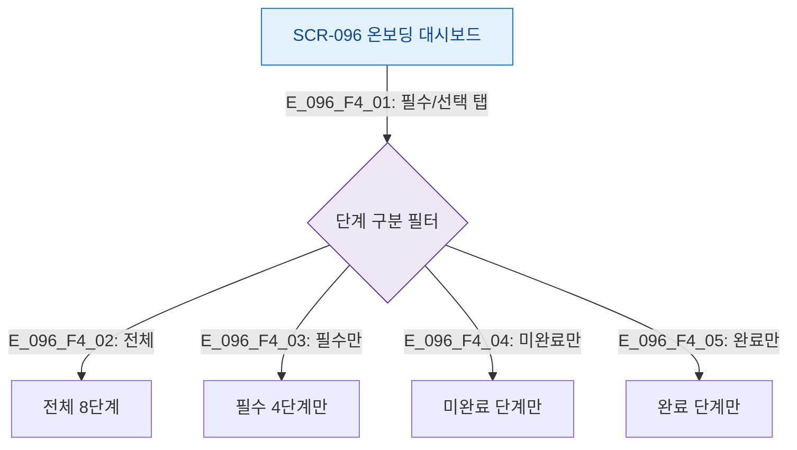

# F4 필터 플로우 — SCR-096 온보딩 대시보드

```mermaid
flowchart TD
  SCR_096[SCR-096 온보딩 대시보드]

  SCR_096 -->|E_096_F4_01: 필수/선택 탭| RequiredFilter{단계 구분 필터}
  RequiredFilter -->|E_096_F4_02: 전체| AllSteps[전체 8단계]
  RequiredFilter -->|E_096_F4_03: 필수만| RequiredOnly[필수 4단계만]
  RequiredFilter -->|E_096_F4_04: 미완료만| PendingOnly[미완료 단계만]
  RequiredFilter -->|E_096_F4_05: 완료만| DoneOnly[완료 단계만]

  classDef screen fill:#E3F2FD,stroke:#1976D2,color:#0D47A1
  classDef system fill:#EDE7F6,stroke:#5E35B2

  class SCR_096 screen
  class RequiredFilter system
```

## TC 후보

| TC ID | 타입 | Given | When | Then |
|-------|:----:|-------|------|------|
| TC-096-F4-001 | P2 positive | 일부 완료 상태 | 미완료 필터 | 미완료 단계만 표시 |
