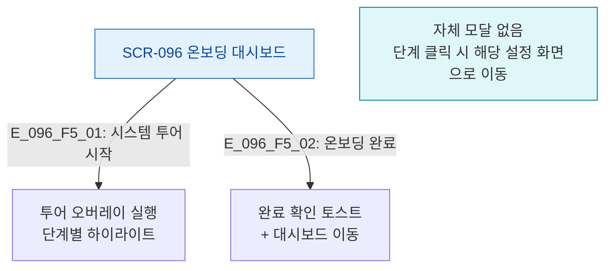

# F5 모달 트리거 트리 — SCR-096 온보딩 대시보드

```mermaid
flowchart TD
  SCR_096[SCR-096 온보딩 대시보드]
  Note[자체 모달 없음\n단계 클릭 시 해당 설정 화면으로 이동]

  SCR_096 -->|"E_096_F5_01: 시스템 투어 시작"| TourOverlay[투어 오버레이 실행\n단계별 하이라이트]
  SCR_096 -->|"E_096_F5_02: 온보딩 완료"| CompleteConfirm[완료 확인 토스트\n+ 대시보드 이동]

  classDef screen fill:#E3F2FD,stroke:#1976D2,color:#0D47A1
  classDef info fill:#E0F7FA,stroke:#00838F

  class SCR_096 screen
  class Note info
```

## TC 후보

| TC ID | 타입 | Given | When | Then |
|-------|:----:|-------|------|------|
| TC-096-F5-001 | P2 positive | 8단계 투어 버튼 | 클릭 | 투어 오버레이 시작 |
