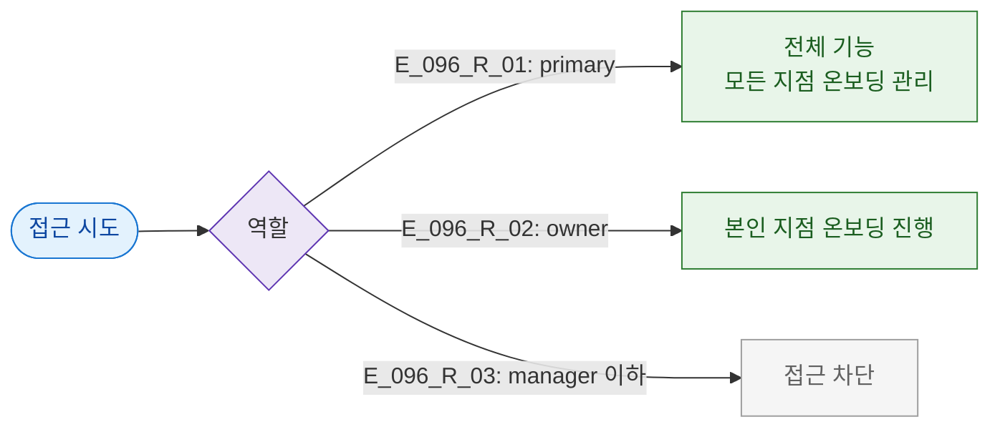

# F7 권한(RBAC) 분기 플로우 — SCR-096 온보딩 대시보드

```mermaid
flowchart LR
  Entry([접근 시도]) --> Role{역할}

  Role -->|"E_096_R_01: primary"| PrimaryAccess[전체 기능\n모든 지점 온보딩 관리]
  Role -->|"E_096_R_02: owner"| OwnerAccess[본인 지점 온보딩 진행]
  Role -->|"E_096_R_03: manager 이하"| Blocked[접근 차단]

  classDef screen fill:#E3F2FD,stroke:#1976D2,color:#0D47A1
  classDef system fill:#EDE7F6,stroke:#5E35B2
  classDef success fill:#E8F5E9,stroke:#2E7D32,color:#1B5E20
  classDef rbacBlocked fill:#F5F5F5,stroke:#9E9E9E,color:#616161

  class Entry screen
  class Role system
  class PrimaryAccess,OwnerAccess success
  class Blocked rbacBlocked
```

## TC 후보

| TC ID | 타입 | Given | When | Then |
|-------|:----:|-------|------|------|
| TC-096-F7-001 | P0 negative | manager | /onboarding | 접근 차단 |
